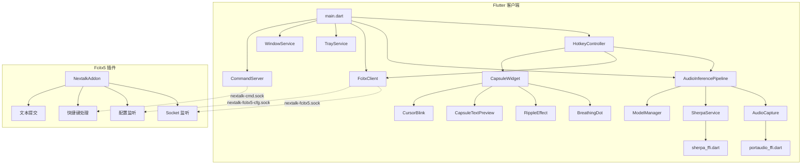

# Nextalk 组件清单

## Part 1: Voice Capsule (Flutter 客户端)

### UI 组件

| 组件 | 路径 | 说明 |
|------|------|------|
| **CapsuleWidget** | `ui/capsule_widget.dart` | 主胶囊窗口组件，整合所有子组件 |
| **BreathingDot** | `ui/breathing_dot.dart` | 呼吸灯动画 (录音状态指示) |
| **RippleEffect** | `ui/ripple_effect.dart` | 波纹扩散效果 |
| **PulseIndicator** | `ui/pulse_indicator.dart` | 脉冲指示器 |
| **CapsuleTextPreview** | `ui/capsule_text_preview.dart` | 实时文本预览区 |
| **CursorBlink** | `ui/cursor_blink.dart` | 光标闪烁动画 |
| **StateIndicator** | `ui/state_indicator.dart` | 状态指示器 |
| **ErrorActionWidget** | `ui/error_action_widget.dart` | 错误提示组件 |
| **FatalErrorDialog** | `ui/fatal_error_dialog.dart` | 致命错误对话框 |
| **InitWizard** | `ui/init_wizard/` | 初始化向导 (模型下载) |

### 服务层

| 服务 | 路径 | 职责 |
|------|------|------|
| **SherpaService** | `services/sherpa_service.dart` | AI 推理服务，封装 Sherpa-onnx FFI |
| **AudioCapture** | `services/audio_capture.dart` | 音频采集，封装 PortAudio FFI |
| **AudioInferencePipeline** | `services/audio_inference_pipeline.dart` | 音频→推理流水线，零拷贝数据流 |
| **FcitxClient** | `services/fcitx_client.dart` | Fcitx5 Socket 通信客户端 |
| **CommandServer** | `services/command_server.dart` | 接收 Fcitx5 命令 (Wayland 支持) |
| **ModelManager** | `services/model_manager.dart` | 模型下载、校验、管理 |
| **SettingsService** | `services/settings_service.dart` | 配置管理 (SharedPreferences + YAML) |
| **TrayService** | `services/tray_service.dart` | 系统托盘管理 |
| **WindowService** | `services/window_service.dart` | 窗口属性管理 (透明、位置等) |
| **HotkeyService** | `services/hotkey_service.dart` | 快捷键监听 |
| **HotkeyController** | `services/hotkey_controller.dart` | 快捷键业务逻辑控制 |
| **LanguageService** | `services/language_service.dart` | 国际化服务 |
| **AnimationTickerService** | `services/animation_ticker_service.dart` | 动画预热服务 |

### FFI 绑定

| 模块 | 路径 | 绑定目标 |
|------|------|----------|
| **SherpaFFI** | `ffi/sherpa_ffi.dart` | libsherpa-onnx-c-api.so |
| **SherpaOnnxBindings** | `ffi/sherpa_onnx_bindings.dart` | Sherpa 类型定义 |
| **PortAudioFFI** | `ffi/portaudio_ffi.dart` | libportaudio.so |

### 状态管理

| 类 | 路径 | 说明 |
|----|------|------|
| **CapsuleStateData** | `state/capsule_state.dart` | 胶囊 UI 状态数据 |
| **InitState** | `state/init_state.dart` | 初始化状态枚举 |

### 常量定义

| 文件 | 内容 |
|------|------|
| `animation_constants.dart` | 动画参数 (时长、曲线) |
| `capsule_colors.dart` | 颜色定义 (背景、文字、状态色) |
| `hotkey_constants.dart` | 快捷键相关常量 |
| `settings_constants.dart` | 配置键名、模型类型枚举 |
| `tray_constants.dart` | 托盘菜单项 |
| `window_constants.dart` | 窗口尺寸、位置 |

### 工具类

| 类 | 路径 | 功能 |
|----|------|------|
| **DiagnosticLogger** | `utils/diagnostic_logger.dart` | 诊断日志系统 |
| **ClipboardHelper** | `utils/clipboard_helper.dart` | 剪贴板操作 |

### 国际化

| 文件 | 语言 |
|------|------|
| `l10n/app_en.arb` | 英文 |
| `l10n/app_zh.arb` | 中文 |

---

## Part 2: Nextalk Addon (Fcitx5 插件)

### 核心类

| 类 | 文件 | 职责 |
|----|------|------|
| **NextalkAddon** | `nextalk.cpp` | 插件主类，继承 `AddonInstance` |
| **NextalkAddonFactory** | `nextalk.cpp` | 插件工厂 |

### 主要功能模块

| 模块 | 方法 | 说明 |
|------|------|------|
| **Socket 服务器** | `startSocketListener()`, `socketListenerLoop()` | 接收 Flutter 文本 |
| **配置服务器** | `startConfigListener()`, `configListenerLoop()` | 接收配置命令 |
| **快捷键监听** | `setupKeyEventHandler()`, `handleKeyEvent()` | 全局快捷键 |
| **文本提交** | `commitText()` | 通过 InputContext 提交文本 |
| **命令发送** | `sendCommandToFlutter()` | 向 Flutter 发送控制命令 |
| **焦点锁定** | `lockedInputContextUUID_` | Wayland 焦点锁定机制 |

### Socket 端点

| Socket | 路径 | 方向 |
|--------|------|------|
| 文本接收 | `$XDG_RUNTIME_DIR/nextalk-fcitx5.sock` | Flutter → 插件 |
| 配置接收 | `$XDG_RUNTIME_DIR/nextalk-fcitx5-cfg.sock` | Flutter → 插件 |
| 命令发送 | `$XDG_RUNTIME_DIR/nextalk-cmd.sock` | 插件 → Flutter |

### 协议格式

所有 Socket 通信使用统一协议:

```
[4字节长度 (Little Endian)] + [UTF-8 文本载荷]
```

---

## 组件依赖关系



---

## 组件状态表

| 组件 | 状态 | 测试覆盖 |
|------|------|----------|
| CapsuleWidget | ✅ 完成 | 部分 |
| BreathingDot | ✅ 完成 | 无 |
| RippleEffect | ✅ 完成 | 无 |
| SherpaService | ✅ 完成 | 部分 |
| AudioCapture | ✅ 完成 | 部分 |
| AudioInferencePipeline | ✅ 完成 | 部分 |
| FcitxClient | ✅ 完成 | 部分 |
| CommandServer | ✅ 完成 | 无 |
| ModelManager | ✅ 完成 | 部分 |
| TrayService | ✅ 完成 | 无 |
| WindowService | ✅ 完成 | 无 |
| HotkeyController | ✅ 完成 | 无 |
| NextalkAddon (C++) | ✅ 完成 | 无 |
