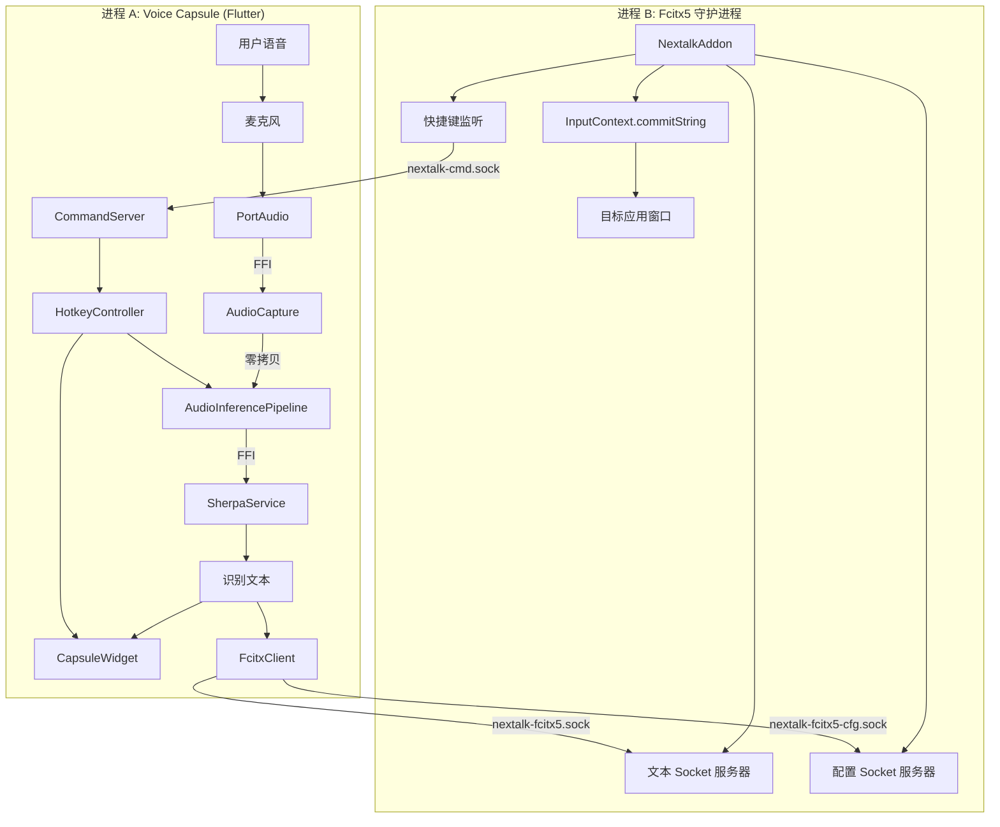
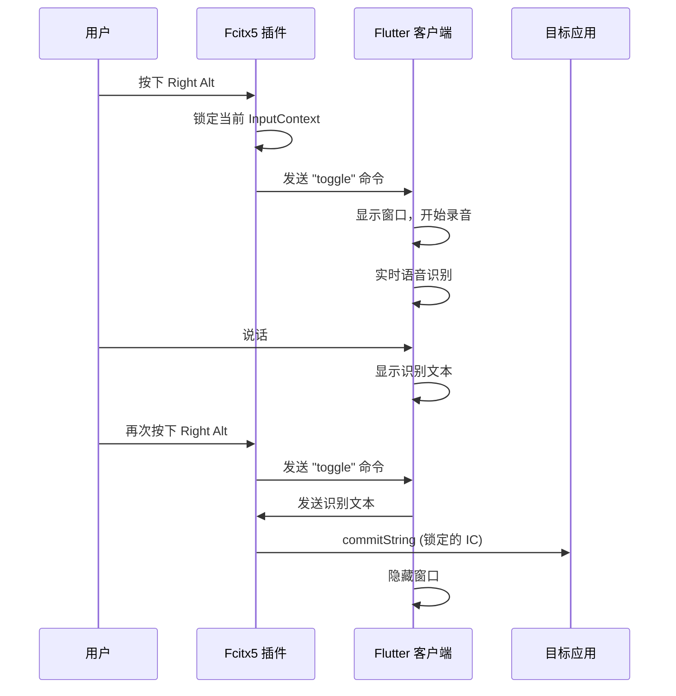

# Nextalk 集成架构

## 概述

Nextalk 采用**双进程混合架构**，通过 Unix Domain Socket 实现进程间通信:

- **进程 A**: Voice Capsule (Flutter 桌面应用)
- **进程 B**: Nextalk Addon (Fcitx5 插件)

## 系统架构图



## 通信协议

### Socket 端点

| Socket 路径 | 方向 | 用途 | 发起方 |
|-------------|------|------|--------|
| `$XDG_RUNTIME_DIR/nextalk-fcitx5.sock` | Flutter → 插件 | 文本提交 | FcitxClient |
| `$XDG_RUNTIME_DIR/nextalk-fcitx5-cfg.sock` | Flutter → 插件 | 配置命令 | HotkeyService |
| `$XDG_RUNTIME_DIR/nextalk-cmd.sock` | 插件 → Flutter | 控制命令 | NextalkAddon |

### 消息格式

所有 Socket 通信使用统一的二进制协议:

```
+----------------+------------------+
| 长度 (4 bytes) | 载荷 (N bytes)   |
| Little Endian  | UTF-8 字符串     |
+----------------+------------------+
```

### 消息类型

#### 文本提交 (Flutter → 插件)

```
载荷: <识别的文本>
示例: "你好世界"
```

#### 配置命令 (Flutter → 插件)

```
载荷: config:hotkey:<key_spec>
示例: "config:hotkey:Control+Shift+Space"
```

#### 控制命令 (插件 → Flutter)

```
载荷: <命令名>
示例: "toggle", "show", "hide"
```

## 核心交互流程

### 1. 语音输入流程



### 2. 焦点锁定机制

解决 Wayland 下窗口切换导致文本提交到错误应用的问题:

```
1. 用户按下快捷键 (在应用 A 中)
2. 插件锁定应用 A 的 InputContext UUID
3. 用户说话，可能切换到应用 B
4. 用户再次按下快捷键
5. Flutter 发送识别文本
6. 插件使用锁定的 UUID 找到应用 A 的 InputContext
7. 文本提交到应用 A (而非当前焦点的应用 B)
8. 清除锁定状态
```

### 3. 文本提交流程 (IME 周期模拟)

为确保终端等应用正确处理输入:

```cpp
// 1. 设置 Preedit (告诉应用"正在输入")
ic->inputPanel().setClientPreedit(Text(text));
ic->updatePreedit();

// 2. 提交文本
ic->commitString(text);

// 3. 清空 Preedit
ic->inputPanel().setClientPreedit(Text(""));
ic->updatePreedit();
```

## 集成点详情

### Flutter → Fcitx5 (文本提交)

**发送方**: `FcitxClient.sendText()`

```dart
Future<void> sendText(String text) async {
  final socket = await Socket.connect(
    InternetAddress(_socketPath, type: InternetAddressType.unix),
    0,
  );

  // 协议: 4字节长度 + UTF-8文本
  final bytes = utf8.encode(text);
  final lengthBytes = ByteData(4)..setUint32(0, bytes.length, Endian.little);
  socket.add(lengthBytes.buffer.asUint8List());
  socket.add(bytes);

  await socket.flush();
  await socket.close();
}
```

**接收方**: `NextalkAddon::handleClient()`

### Flutter → Fcitx5 (配置命令)

**发送方**: `HotkeyService.sendConfig()`

**接收方**: `NextalkAddon::handleConfigClient()` → `processCommand()`

### Fcitx5 → Flutter (控制命令)

**发送方**: `NextalkAddon::sendCommandToFlutter()`

**接收方**: `CommandServer.onCommand` → `HotkeyController.toggle()`

## 错误处理

### Socket 连接失败

- Flutter 侧: 进入降级模式，允许录音但不提交
- 插件侧: 静默失败 (Flutter 可能未运行)

### 超时处理

- 文本 Socket: 30 秒超时
- 配置 Socket: 5 秒超时
- 命令 Socket: 1 秒超时

### 安全措施

- 所有 Socket 文件权限设为 `0600`
- 消息大小限制: 1MB

## 部署要求

### 运行时依赖

- Fcitx5 输入法框架已安装并运行
- XDG_RUNTIME_DIR 环境变量已设置

### 启动顺序

1. Fcitx5 守护进程启动，加载 Nextalk Addon
2. Addon 创建 Socket 服务器
3. Flutter 客户端启动
4. Flutter 连接 Socket 服务器
5. 系统就绪，等待用户触发
