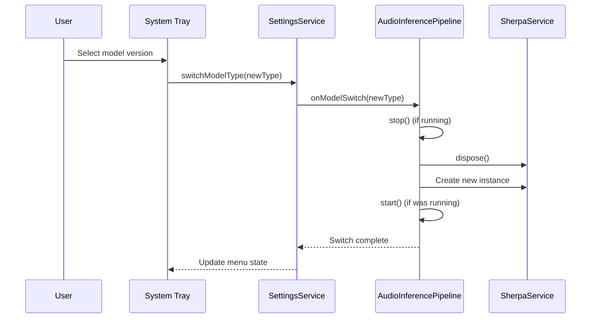

# Architecture Document: Nextalk

[简体中文](architecture_zh.md) | English

| Date | Version | Description | Author |
| :--- | :--- | :--- | :--- |
| 2025-12-21 | 1.1 | Complete architecture design (Flutter/C++ hybrid, dynamic model download) | Architect (Winston) |
| 2025-12-28 | 2.0 | Minimal architecture refactor (SCP-002: Remove hotkey listener, use system native shortcuts) | Architect (Winston) |

## 1. Introduction

**Nextalk** is a high-performance voice input application designed specifically for Linux, using a Hybrid Architecture. It combines a modern **Flutter** frontend (responsible for UI, orchestration, and AI inference) with a native **C++** engine (Fcitx5 plugin) to provide system-level input capabilities.

The system is designed as a **Monorepo**, containing two independent processes communicating via IPC:
1. **Voice Capsule (Client)**: A standalone Flutter desktop application responsible for UI display, audio capture, model management, and speech recognition.
2. **Nextalk Addon (Server)**: A lightweight Fcitx5 plugin responsible for receiving commands and injecting text into target applications.

## 2. High Level Architecture

### 2.1 System Context Diagram

```mermaid
graph TD
    User[User Voice] --> Mic[Microphone]
    Mic --> Audio[PortAudio (C Library)]

    subgraph "Process A: Voice Capsule (Flutter)"
        Audio -- "FFI (Zero-copy)" --> Logic[Dart Business Logic]
        Logic -- "FFI (Zero-copy)" --> Sherpa[Sherpa-onnx (AI Engine)]
        Sherpa -- "Text Stream" --> Logic
        Logic -- "State Update" --> UI[Transparent Capsule Window]
        Logic -- "Text Socket" --> IPC_Text[Text Send]
        SingleInstance[Single Instance Manager] -- "--toggle command" --> Logic
        ModelMgr[Model Manager] -- "Download/Verify" --> Storage[Local Storage (~/.local)]
    end

    subgraph "Process B: Fcitx5 Daemon"
        IPC_Text -- "nextalk-fcitx5.sock" --> IPC_Server[Nextalk Plugin]
        IPC_Server -- "commitString" --> TargetApp[Current Active Window]
    end

    subgraph "System Shortcuts"
        SystemShortcut[GNOME/KDE Shortcut Settings] -- "nextalk --toggle" --> SingleInstance
    end

    subgraph "Fallback Path"
        Logic -- "Fcitx5 Unavailable" --> Clipboard[System Clipboard]
        Clipboard -- "User Manual Paste" --> TargetApp
    end
```

> **SCP-002 Change Note**: Hotkey listening has been removed from the Fcitx5 plugin, replaced with system native shortcut configuration (e.g., GNOME Settings → Keyboard → Custom Shortcuts) calling `nextalk --toggle` command.

### 2.2 Directory Structure (Monorepo)

The project uses a strict Monorepo structure, separating frontend/backend code and external dependencies.

```text
nextalk/
├── docs/                     # Design documents (PRD, Architecture)
├── scripts/                  # DevOps scripts (install plugin, build helpers)
├── libs/                     # External precompiled dynamic libraries (.so)
│   ├── libsherpa-onnx-c-api.so
│   └── libonnxruntime.so
├── addons/                   # [Backend] Fcitx5 C++ plugin
│   └── fcitx5/
│       ├── CMakeLists.txt
│       └── src/              # Native C++ implementation (nextalk.cpp)
└── voice_capsule/            # [Frontend] Flutter client
    ├── pubspec.yaml
    ├── linux/                # Linux build config (CMakeLists.txt modification needed)
    ├── assets/               # Only icons, fonts and lightweight resources (no models)
    └── lib/
        ├── main.dart         # UI entry
        ├── ffi/              # Native binding layer ("brain" neural connections)
        │   ├── sherpa_ffi.dart
        │   └── portaudio_ffi.dart
        ├── constants/        # Constant definitions
        │   ├── settings_constants.dart  # Settings service constants and model type enums
        │   └── tray_constants.dart      # System tray menu constants
        ├── services/         # Business logic
        │   ├── sherpa_service.dart
        │   ├── model_manager.dart   # Model download and management
        │   ├── settings_service.dart # Configuration management service
        │   ├── tray_service.dart    # System tray service
        │   └── fcitx_client.dart
        └── ui/               # Widget component definitions
```

## 3. Technology Stack

| Component | Technology | Version | Selection Rationale |
| :--- | :--- | :--- | :--- |
| **Frontend UI** | Flutter (Dart) | 3.x+ | Best true-transparent, borderless rendering on Linux. |
| **ASR Engine** | Sherpa-onnx | Latest | High-performance, offline, streaming support, standard C-API. |
| **Audio Capture** | PortAudio | v19 | Industry standard for cross-platform audio I/O on Linux (ALSA/Pulse compatible). |
| **Language Binding** | `dart:ffi` | Native | Zero-overhead interop with C libraries. |
| **IPC** | Unix Domain Socket | Standard | Simple, secure, low-latency local communication. |
| **Backend Plugin** | C++ | C++17 | Hard requirement for Fcitx5 native plugins. |

## 4. Core Component Design

### 4.1 Fcitx5 Plugin and Protocol

**Role**: Text injection service. Receives text from Flutter client and injects into target application via Fcitx5's `commitString` interface.

> **SCP-002 Simplification**: Plugin responsibilities simplified to text submission only, hotkey listening and config sync removed.

#### 4.1.1 Socket Architecture

Plugin uses a single Unix Domain Socket for communication:

| Socket Path | Direction | Purpose | Protocol |
| :--- | :--- | :--- | :--- |
| `$XDG_RUNTIME_DIR/nextalk-fcitx5.sock` | Flutter → Plugin | Text submission | Length-prefix + UTF-8 |

* **Transport Layer**: Unix Domain Socket (Stream mode).
* **Security**: Socket file permissions must be `0600` (owner read/write only).
* **Protocol Definition**:

| Offset | Type | Size | Description |
| :--- | :--- | :--- | :--- |
| 0 | `uint32` | 4 | **Length** (Little Endian). Byte length of following string. |
| 4 | `bytes` | N | **Payload**. UTF-8 encoded text. |

#### 4.1.2 Hotkey Scheme

**SCP-002 Change**: Hotkey listening removed from Fcitx5 plugin, replaced with system native shortcut scheme:

* **Configuration**: GNOME Settings → Keyboard → Custom Shortcuts (or equivalent in KDE/other DEs)
* **Command**: `nextalk --toggle`

**Single Instance Management**:
* App checks for existing instance on startup
* If running, sends command via Unix Socket (`$XDG_RUNTIME_DIR/nextalk.sock`)
* Single instance socket for internal app communication, independent from Fcitx5 plugin socket

#### 4.1.3 Clipboard Fallback

When Fcitx5 plugin is unavailable (non-Fcitx5 environment or plugin not loaded), system auto-enables clipboard fallback:

1. Check if Fcitx5 Socket exists
2. If not, copy recognized text to system clipboard
3. UI shows prompt: "Copied to clipboard, please paste"
4. Auto-hide window after 2 seconds

#### 4.1.4 Text Submission Flow (IME Cycle Simulation)

To ensure terminals and similar apps correctly handle input, `commitText` simulates complete IME cycle:

1. **Set Preedit**: Tell app "currently inputting"
2. **Commit Text**: Call `commitString()`
3. **Clear Preedit**: Complete input cycle

### 4.2 Audio and AI Pipeline (Zero-copy FFI)

To meet **NFR1 (Latency < 200ms)**, audio pipeline must minimize memory copies.

1. **Memory Allocation**: Dart allocates off-heap buffer (`Pointer<Float>`) using `calloc`.
2. **Capture**: Dart passes this pointer to PortAudio's `Pa_ReadStream`. C code writes PCM data directly to this memory address.
3. **Inference**: Dart passes **same pointer** to Sherpa's `AcceptWaveform`. During streaming, no data copy occurs between Dart/C boundary.
4. **Result**: Only when Sherpa returns recognized text is the string copied to Dart managed memory for UI display.

**Concurrency Model**:
* **Main Isolate**: Audio reading and inference calls are blocking but extremely fast (processing 100ms audio chunk typically <10ms). For simplicity, MVP runs in main Isolate.
* **Fallback**: If UI frame drops occur on low-end hardware, move pipeline to `Isolate.spawn` background.

### 4.3 FFI Interface Definition

Dart FFI bindings must mirror Sherpa-onnx's C-API.

```dart
// Binding structure concept example
typedef AcceptWaveformC = Void Function(Pointer<Void> stream, Int32 sampleRate, Pointer<Float> buffer, Int32 n);
typedef AcceptWaveformDart = void Function(Pointer<Void> stream, int sampleRate, Pointer<Float> buffer, int n);

class SherpaService {
  late DynamicLibrary _lib;
  late AcceptWaveformDart _acceptWaveform;

  void feedAudio(Pointer<Float> data, int samples) {
    _acceptWaveform(_stream, 16000, data, samples);
  }
}
```

### 4.4 Model Management

To reduce installation package size, model files use **"Download-on-Demand"** strategy.

1. **Storage Path**: Follows XDG Base Directory specification.
   * Path: `$XDG_DATA_HOME/nextalk/models` (default `~/.local/share/nextalk/models`)
2. **Startup Flow**:
   * App starts -> Check model file integrity.
   * **Missing**: Navigate to `DownloadPage`, download and extract model package.
   * **Present**: Initialize Sherpa engine -> Enter main interface.
3. **Model Source**: `zipformer` package hosted on HuggingFace or GitHub Releases.
4. **Custom URL**: Support custom model download URL via config file.

### 4.5 Settings Service

Settings service provides model version selection and advanced configuration management.

**Architecture Design**:
* **Dual-layer Storage**: Runtime config uses `SharedPreferences`, advanced config uses YAML file.
* **Hot Switch**: Support runtime model version switching without app restart.
* **XDG Spec**: Config file path follows XDG Base Directory specification.

**Config File Structure**:

```yaml
# ~/.config/nextalk/settings.yaml
model:
  # Custom model download URL (leave empty for default)
  custom_url: ""

  # Model version: int8 | standard
  # int8: Quantized version, faster, smaller memory
  # standard: Standard version, higher accuracy
  type: int8
```

**Model Versions**:

| Version | Features | Use Case |
| :--- | :--- | :--- |
| `int8` | Quantized model, smaller size, faster inference | Daily use, low-spec devices |
| `standard` | Standard model, higher accuracy | Scenarios requiring high recognition accuracy |

**Hot Switch Flow**:



**System Tray Integration**:
* Provides "Model Settings" submenu
* Supports int8/standard version switching (checkbox)
* Provides "Open Config Directory" quick action

## 5. Infrastructure and Build System

### 5.1 Library Linking Strategy

Flutter's Linux build uses CMake. We need to ensure external `.so` libraries are correctly packaged.

**Linking Config (`linux/CMakeLists.txt`)**:
1. **System Libraries**: `libportaudio.so` dynamically linked from system (assumes user installed via `apt`).
2. **Bundled Libraries**: `libsherpa-onnx-c-api.so` copied from project's `libs/` directory to build artifacts.

### 5.2 RPATH Configuration

Ensure binary can find bundled libraries at runtime:

```cmake
# In linux/CMakeLists.txt
install(FILES "${PROJECT_SOURCE_DIR}/../libs/libsherpa-onnx-c-api.so"
        DESTINATION "${CMAKE_INSTALL_PREFIX}/lib"
        COMPONENT Runtime)

# Set RPATH to look for dependencies in 'lib' directory next to executable
set(CMAKE_INSTALL_RPATH "$ORIGIN/lib")
```

### 5.3 Release Bundle Layout

Final build artifact (Bundle) structure, keeping lightweight:

```text
bundle/
├── nextalk              # Executable
├── lib/
│   ├── libsherpa-onnx-c-api.so  # Private dependency library
│   └── libflutter_linux_gtk.so
└── data/                # Flutter's own resources (no models)
```

## 6. Security and Error Handling

* **Socket Permissions**: C++ plugin must enforce `chmod 600` on Socket file, preventing other users' processes from injecting malicious commands.
* **Network Permissions**: Flutter client needs network permission for model download.
* **Audio Failure**: If PortAudio cannot open stream (e.g., device exclusive), UI must show visual error indication (e.g., red light turns yellow/gray).
* **Download Verification**: Must verify SHA256 after download, preventing corrupted files from crashing engine.
