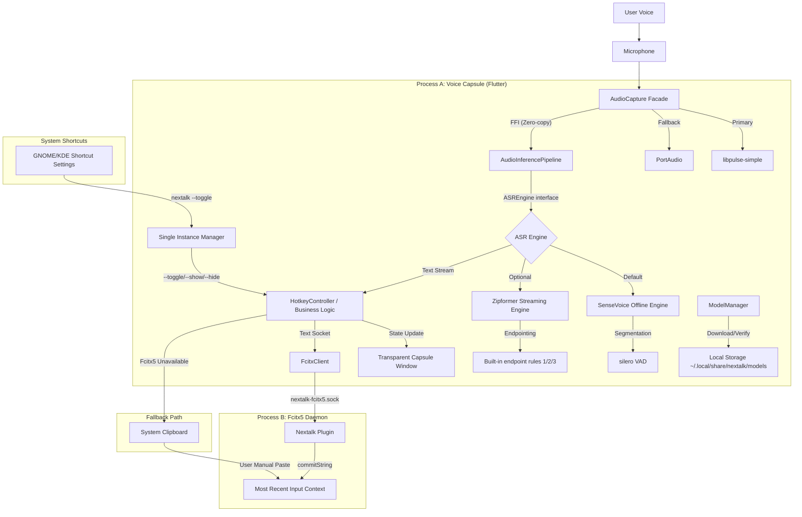

# Architecture Document: Nextalk

[简体中文](architecture_zh.md) | English

| Date | Version | Description | Author |
| :--- | :--- | :--- | :--- |
| 2025-12-21 | 1.1 | Complete architecture design (Flutter/C++ hybrid, dynamic model download) | Architect (Winston) |
| 2025-12-28 | 2.0 | Minimal architecture refactor (SCP-002: Remove hotkey listener, use system native shortcuts) | Architect (Winston) |
| 2026-07-09 | 2.1 | Brownfield calibration to v0.2.8: documented dual-engine ASR architecture (SenseVoice default), silero VAD, layered audio capture (libpulse-simple primary / PortAudio fallback), concurrency model conclusion, actual IPC constraints, model verification status, build/versioning conventions | Architect (Winston) |

## 1. Introduction

**Nextalk** is a high-performance voice input application designed specifically for Linux, using a Hybrid Architecture. It combines a modern **Flutter** frontend (responsible for UI, orchestration, and AI inference) with a native **C++** engine (Fcitx5 plugin) to provide system-level input capabilities.

The system is designed as a **Monorepo**, containing two independent processes communicating via IPC:
1. **Voice Capsule (Client)**: A standalone Flutter desktop application responsible for UI display, audio capture, model management, and speech recognition (dual engine: SenseVoice offline / Zipformer streaming).
2. **Nextalk Addon (Server)**: A lightweight Fcitx5 plugin responsible for receiving text and injecting it into target applications.

## 2. High Level Architecture

### 2.1 System Context Diagram


```mermaid
graph TD
    User[User Voice] --> Mic[Microphone]
    Mic --> Capture[AudioCapture Facade]

    subgraph "Process A: Voice Capsule (Flutter)"
        Capture -- "Primary" --> Pulse[libpulse-simple]
        Capture -- "Fallback" --> PA[PortAudio]
        Capture -- "FFI (Zero-copy)" --> Pipeline[AudioInferencePipeline]
        Pipeline -- "ASREngine interface" --> Engine{ASR Engine}
        Engine -- "Default" --> SV[SenseVoice Offline Engine]
        Engine -- "Optional" --> ZF[Zipformer Streaming Engine]
        SV -- "Segmentation" --> VAD[silero VAD]
        ZF -- "Endpointing" --> EP[Built-in endpoint rules 1/2/3]
        Engine -- "Text Stream" --> Logic[HotkeyController / Business Logic]
        Logic -- "State Update" --> UI[Transparent Capsule Window]
        Logic -- "Text Socket" --> IPC_Text[FcitxClient]
        SingleInstance[Single Instance Manager] -- "--toggle/--show/--hide" --> Logic
        ModelMgr[ModelManager] -- "Download/Verify" --> Storage[Local Storage ~/.local/share/nextalk/models]
    end

    subgraph "Process B: Fcitx5 Daemon"
        IPC_Text -- "nextalk-fcitx5.sock" --> IPC_Server[Nextalk Plugin]
        IPC_Server -- "commitString" --> TargetApp[Most Recent Input Context]
    end

    subgraph "System Shortcuts"
        SystemShortcut[GNOME/KDE Shortcut Settings] -- "nextalk --toggle" --> SingleInstance
    end

    subgraph "Fallback Path"
        Logic -- "Fcitx5 Unavailable" --> Clipboard[System Clipboard]
        Clipboard -- "User Manual Paste" --> TargetApp
    end
```

> **SCP-002 Change Note**: Hotkey listening has been removed from the Fcitx5 plugin, replaced with system native shortcut configuration (e.g., GNOME Settings → Keyboard → Custom Shortcuts) calling `nextalk --toggle`. The app itself performs no global key listening.

### 2.2 Directory Structure (Monorepo)

The project uses a strict Monorepo structure, separating frontend/backend code and external dependencies.

```text
nextalk/
├── docs/                     # Design documents (PRD, Architecture, UX spec, pitfalls)
├── scripts/                  # DevOps scripts (build-pkg.sh, docker-build.sh, install_addon.sh, release.sh)
├── version.yaml              # Version source of truth (app_version / addon_version)
├── libs/                     # External precompiled dynamic libraries (.so)
│   ├── libsherpa-onnx-c-api.so
│   └── libonnxruntime.so
├── addons/                   # [Backend] Fcitx5 C++ plugin
│   └── fcitx5/
│       ├── CMakeLists.txt
│       └── src/              # nextalk.cpp / nextalk.h / nextalk.conf.in
└── voice_capsule/            # [Frontend] Flutter client
    ├── pubspec.yaml
    ├── linux/                # Linux build config (CMakeLists.txt, C++ Runner modification)
    ├── assets/               # Only icons, fonts and lightweight resources (no models)
    └── lib/
        ├── main.dart         # Entry: CLI arg handling + single instance + service assembly
        ├── app/              # App shell
        ├── cli/              # CLI subcommands (audio device management)
        ├── constants/        # Constants (settings/tray/hotkey/window/animation/capsule_colors)
        ├── ffi/              # Native binding layer
        │   ├── sherpa_onnx_bindings.dart    # Streaming recognition C-API
        │   ├── sherpa_offline_bindings.dart # Offline recognition C-API (SenseVoice)
        │   ├── sherpa_vad_bindings.dart     # VAD C-API (silero)
        │   ├── sherpa_ffi.dart
        │   ├── libpulse_ffi.dart            # Device enumeration
        │   ├── libpulse_simple_ffi.dart     # Primary audio capture path
        │   └── portaudio_ffi.dart           # Fallback audio capture path
        ├── l10n/             # Internationalization (zh/en ARB)
        ├── services/         # Business logic
        │   ├── asr/          # ASR engine abstraction layer
        │   │   ├── asr_engine.dart          # ASREngine interface
        │   │   ├── asr_engine_factory.dart  # Engine construction by config
        │   │   ├── engine_initializer.dart  # Initialization / model checks
        │   │   ├── sensevoice_engine.dart   # Offline engine (default)
        │   │   └── zipformer_engine.dart    # Streaming engine
        │   ├── audio_capture.dart           # Capture facade (Pulse primary / PortAudio fallback)
        │   ├── pulse_audio_capture.dart     # libpulse-simple capture implementation
        │   ├── audio_device_service.dart    # Device enumeration & selection (Story 3-9)
        │   ├── audio_inference_pipeline.dart# Capture→VAD→inference pipeline
        │   ├── sherpa_service.dart
        │   ├── model_manager.dart           # Download & management of three model classes
        │   ├── settings_service.dart        # Config management (SharedPreferences + YAML)
        │   ├── hotkey_controller.dart       # Business state machine (idle/recording/submitting)
        │   ├── hotkey_service.dart          # Hotkey config loading (hint text only)
        │   ├── single_instance.dart         # Single instance + command forwarding socket
        │   ├── fcitx_client.dart            # Text submission client + clipboard fallback
        │   ├── tray_service.dart            # System tray
        │   ├── language_service.dart        # UI language switching (Story 3-8)
        │   ├── window_service.dart          # Window show/hide/positioning
        │   ├── flutter_window_backend.dart
        │   └── animation_ticker_service.dart
        ├── state/            # Capsule UI state model
        ├── ui/               # Widget components (incl. init_wizard/)
        └── utils/            # Utilities (clipboard_helper, etc.)
```

## 3. Technology Stack

| Component | Technology | Version | Selection Rationale |
| :--- | :--- | :--- | :--- |
| **Frontend UI** | Flutter (Dart) | 3.x+ | Best true-transparent, borderless rendering on Linux. |
| **ASR Engine (default)** | Sherpa-onnx SenseVoice (offline) | Latest | Whole-segment recognition after VAD segmentation; high accuracy, multilingual, ITN support. |
| **ASR Engine (optional)** | Sherpa-onnx Zipformer (streaming) | Latest | Recognize-while-listening, low latency; int8/standard variants. |
| **Endpoint Detection (SenseVoice)** | silero VAD (via sherpa-onnx VAD API) | Latest | Standalone VAD model, segments the offline path. |
| **Endpoint Detection (Zipformer)** | sherpa-onnx built-in endpoint rules (rule1/2/3) | Latest | The streaming path does not load silero VAD. |
| **Audio Capture (primary)** | libpulse-simple | Latest | Device names match system settings, auto resampling, PipeWire/PulseAudio integration. |
| **Audio Capture (fallback)** | PortAudio | v19 | Compatibility for non-PulseAudio systems. |
| **Device Enumeration** | libpulse | Latest | Device listing consistent with system settings (PipeWire/PulseAudio). |
| **Language Binding** | `dart:ffi` | Native | Zero-overhead interop with C libraries. |
| **IPC** | Unix Domain Socket | Standard | Simple, secure, low-latency local communication. |
| **Backend Plugin** | C++ | C++17 | Hard requirement for Fcitx5 native plugins. |

## 4. Core Component Design

### 4.1 Fcitx5 Plugin and Protocol

**Role**: Text injection service. Receives text from the Flutter client and injects it into the target application via Fcitx5's `commitString` interface.

> **SCP-002 Simplification**: Plugin responsibilities reduced to text submission only; hotkey listening and config sync removed.

#### 4.1.1 Socket Architecture

The plugin uses a single Unix Domain Socket for communication:

| Socket Path | Direction | Purpose | Protocol |
| :--- | :--- | :--- | :--- |
| `$XDG_RUNTIME_DIR/nextalk-fcitx5.sock` | Flutter → Plugin | Text submission | Length-prefix + UTF-8 |

* **Transport Layer**: Unix Domain Socket (Stream mode).
* **Security**: The plugin enforces `chmod 0600` on the socket file after bind (owner read/write only).
* **Protocol Definition**:

| Offset | Type | Size | Description |
| :--- | :--- | :--- | :--- |
| 0 | `uint32` | 4 | **Length** (Little Endian). Byte length of following string. |
| 4 | `bytes` | N | **Payload**. UTF-8 encoded text. |

* **Actual Constraints (v0.2.8 implementation)**:
    * Per-message limit `MAX_MESSAGE_SIZE = 1MB`; exceeding it disconnects the client.
    * `recv` timeout of 30 seconds, with a zero-byte liveness probe on timeout.
    * The listener loop handles clients sequentially (single-client model); no concurrent connections.
* **Known Limitations (design debt)**:
    * No protocol version/magic number — the client cannot detect the plugin version; protocol evolution requires separate compatibility design. The plugin sends a 1-byte ACK per message, but the client currently does not consume it, so there are no end-to-end acknowledgment semantics.
    * Falls back to `/tmp/nextalk-fcitx5.sock` when `XDG_RUNTIME_DIR` is unset (see §6 Security).

#### 4.1.2 Hotkey Scheme

**SCP-002 Change**: Hotkey listening removed from the Fcitx5 plugin, replaced with the system native shortcut scheme:

* **Configuration**: GNOME Settings → Keyboard → Custom Shortcuts (or equivalent in KDE/other DEs)
* **Command**: `nextalk --toggle` (also `--show`/`--hide`)

**Single Instance Management**:
* App checks for an existing instance on startup
* If running, forwards the command via Unix Socket (`$XDG_RUNTIME_DIR/nextalk.sock`)
* The single-instance socket is for internal app communication, independent from the Fcitx5 plugin socket

#### 4.1.3 Clipboard Fallback

When the Fcitx5 plugin is unavailable (non-Fcitx5 environment or plugin not loaded), the system auto-enables clipboard fallback:

1. Check if the Fcitx5 socket exists
2. If not, copy recognized text to the system clipboard
3. UI shows prompt: "Copied to clipboard, please paste"
4. Auto-hide window after 2 seconds

#### 4.1.4 Text Submission Flow (IME Cycle Simulation)

To ensure terminals and similar apps correctly handle input, `commitText` simulates a complete IME cycle:

1. **Set Preedit**: Tell the app "currently inputting"
2. **Commit Text**: Call `commitString()`
3. **Clear Preedit**: Complete the input cycle

Text is committed to Fcitx5's **most recent input context** (`mostRecentInputContext`) — i.e., whichever input field has focus at submission time; if none exists, all input contexts are traversed to find any focused one. There is no mechanism locking to the window focused when recording started.

### 4.2 Audio and AI Pipeline

#### 4.2.1 Layered Audio Capture

The system uses a **layered audio capture strategy** with `AudioCapture` as the unified facade:

```
┌──────────────────────────────┐
│  AudioCapture (Facade)       │ ← unified read() interface, device-fallback tracking
└──────────────────────────────┘
     │ Primary                      │ Fallback
     ↓                              ↓
┌─────────────────────┐   ┌─────────────────────┐
│  PulseAudioCapture  │   │     PortAudio       │
│  (libpulse-simple)  │   │   (Pa_ReadStream)   │
│  pa_simple_read     │   │   direct ALSA       │
└─────────────────────┘   └─────────────────────┘
```

**Benefits of the libpulse-simple primary path**:
- Device names identical to system settings (e.g., "Built-in Audio Analog Stereo")
- Automatic sample rate conversion (hardware 44100Hz → app 16000Hz)
- Perfect integration with PipeWire/PulseAudio; handles WirePlumber node suspension gracefully

**Device Enumeration**: Uses the libpulse API (`pa_context_get_source_info_list`), with a sink pre-query to wake suspended PipeWire nodes. Device matching order: exact match → substring match → smart default fallback.

#### 4.2.2 Dual-Engine Inference Paths (v2.1 addition, Story 2-7)

The `ASREngine` interface unifies two inference paths, constructed by `ASREngineFactory` per configuration, hot-switchable via tray:

```
                       AudioInferencePipeline
                     ┌────────────┴────────────┐
           (default) │                         │ (optional)
                     ↓                         ↓
        ┌─────────────────────┐   ┌─────────────────────┐
        │  SenseVoiceEngine   │   │  ZipformerEngine    │
        │  (offline)          │   │  (streaming)        │
        │  silero VAD segments│   │  recognize while    │
        │  → whole-segment    │   │  listening,         │
        │  recognition        │   │  char-by-char       │
        │  accuracy/ITN/multi │   │  low latency        │
        └─────────────────────┘   └─────────────────────┘
```

* **SenseVoice path (default)**: Audio is accumulated into speech segments by silero VAD; on silence, the whole segment goes to the offline recognizer and the result is emitted at once. High accuracy, automatic punctuation, but text appears per segment.
* **Zipformer path (optional)**: Audio chunks feed the streaming recognizer directly, emitting text character by character; endpointing uses sherpa-onnx **built-in endpoint rules** (rule1/2/3) — the silero VAD model is not loaded.
* Both paths expose a unified endpoint event stream (`EndpointEvent`) upward, but their endpoint detection mechanisms are independent.

#### 4.2.3 Data Flow and Concurrency Model

The streaming path preserves the zero-copy design:

1. **Memory Allocation**: Dart allocates an off-heap buffer (`Pointer<Float>`) using `calloc`.
2. **Capture**: The pointer is passed to `pa_simple_read` (or `Pa_ReadStream` on fallback); audio data is written directly to this memory.
3. **Inference**: The **same pointer** is passed to Sherpa's `AcceptWaveform`; no data copy crosses the Dart/C boundary.
4. **Result**: Only the recognized text string is copied to Dart managed memory for UI display.

The offline path (SenseVoice) necessarily buffers speech segments during VAD segmentation; it is outside the zero-copy scope.

**Concurrency Model (v2.1 conclusion backfill)**: The pipeline runs in the **main Isolate** as an async polling loop (`Future.delayed` interval polling + blocking `read`); no background Isolate is used. Practice confirmed per-chunk processing time is far below the chunk interval and UI animations show no perceptible frame drops — the original "migrate to `Isolate.spawn` on frame drops" contingency was never triggered and the current state is the final decision.

### 4.3 FFI Interface Definition

Dart FFI bindings are split along sherpa-onnx C-API's three interface groups:

| Binding File | C-API Covered | Purpose |
| :--- | :--- | :--- |
| `sherpa_onnx_bindings.dart` | OnlineRecognizer/OnlineStream | Zipformer streaming recognition |
| `sherpa_offline_bindings.dart` | OfflineRecognizer/OfflineStream | SenseVoice offline recognition |
| `sherpa_vad_bindings.dart` | VoiceActivityDetector | silero VAD |
| `libpulse_simple_ffi.dart` | pa_simple_* | Primary audio capture |
| `libpulse_ffi.dart` | pa_context_* | Device enumeration |
| `portaudio_ffi.dart` | Pa_* | Fallback audio capture |

```dart
// Binding structure concept example
typedef AcceptWaveformC = Void Function(Pointer<Void> stream, Int32 sampleRate, Pointer<Float> buffer, Int32 n);
typedef AcceptWaveformDart = void Function(Pointer<Void> stream, int sampleRate, Pointer<Float> buffer, int n);
```

### 4.4 Model Management

To reduce installation package size, model files use a **"Download-on-Demand"** strategy.

1. **Storage Path**: Follows the XDG Base Directory specification.
   * Path: `$XDG_DATA_HOME/nextalk/models` (default `~/.local/share/nextalk/models`)
2. **Managed Models (v2.1 update)**:

| Model | Purpose | SHA256 Verification |
| :--- | :--- | :--- |
| Zipformer (int8 and standard weights in one archive) | Streaming recognition | ✅ Archive has an official checksum, verified on download |
| SenseVoice | Offline recognition | ⚠️ No official checksum published; skipped |
| silero_vad.onnx | Endpoint detection (single file, SenseVoice engine only) | ⚠️ No official checksum published; skipped |

3. **Startup Flow**: App starts → check integrity of required models → if missing, enter the init wizard to download; if present, initialize the engine and enter the main UI. Downloads show progress and support cancellation.
4. **Model Source**: GitHub Releases (`k2-fsa/sherpa-onnx`).
5. **Custom URL**: The `custom_url` config field currently takes effect only for Zipformer; the SenseVoice field of the same name is not yet effective (known limitation).
6. **Known Limitation**: Models without official checksums get only existence/structure checks; supply-chain integrity relies on trusting the download source (see §6).

### 4.5 Settings Service

The settings service provides engine/model selection and advanced configuration management.

**Architecture Design**:
* **Dual-layer Storage**: Runtime config uses `SharedPreferences`; advanced config uses a YAML file.
* **Hot Switch**: Engine and model variant switchable at runtime without app restart.
* **XDG Spec**: Config file path follows the XDG Base Directory specification.

**Config File Structure (v2.1, synced with implementation)**:

```yaml
# ~/.config/nextalk/settings.yaml
model:
  # ASR engine type: zipformer | sensevoice
  engine: sensevoice

  # Zipformer config (streaming engine)
  zipformer:
    # Model variant: int8 | standard
    type: int8
    # Custom model download URL (empty = default)
    custom_url: ""

  # SenseVoice config (offline engine)
  sensevoice:
    # Inverse text normalization (e.g. "one two three" → "123")
    use_itn: true
    # Recognition language: auto | zh | en | ja | ko | yue
    language: auto
    custom_url: ""

# Hotkey: configured via system settings (command: nextalk --toggle);
# this file contains no hotkey field

audio:
  # Input device: "default" or a device name as shown in system settings
  input_device: default
```

**System Tray Integration**:
* Engine and model variant switching (checkboxes)
* Audio input device selection (Story 3-9)
* UI language switching zh/en (Story 3-8)
* "Open Config Directory" quick action

## 5. Infrastructure and Build System

### 5.1 Version Management (v2.1 New)

* **Source of truth**: root `version.yaml` (`app_version` currently 0.2.8, `addon_version` currently 0.3.0; app and plugin versions managed independently).
* `scripts/docker-build.sh` reads `version.yaml` and injects via `--dart-define=APP_VERSION`; the `version` field in `pubspec.yaml` is not authoritative for releases.
* **Known Gap**: `scripts/build-pkg.sh` does not pass `--dart-define` when rebuilding directly, so the resulting binary self-reports version "dev" — release builds should go through docker-build.sh, or build-pkg.sh needs fixing.

### 5.2 Library Linking Strategy

Flutter's Linux build uses CMake; external `.so` libraries must be packaged correctly.

**Linking Config (`linux/CMakeLists.txt`)**:
1. **System Libraries**: libpulse/libpulse-simple dynamically linked from the system (loaded via dlopen/FFI).
2. **Bundled Libraries**: `libsherpa-onnx-c-api.so`, `libonnxruntime.so`, `libportaudio.so.2` copied into the build artifact's `lib/` directory.

**RPATH Configuration**:

```cmake
# linux/CMakeLists.txt
install(FILES "${PROJECT_SOURCE_DIR}/../libs/libsherpa-onnx-c-api.so"
        DESTINATION "${CMAKE_INSTALL_PREFIX}/lib"
        COMPONENT Runtime)

# Binary looks for dependencies in the adjacent 'lib' directory
set(CMAKE_INSTALL_RPATH "$ORIGIN/lib")
```

### 5.3 Packaging and Distribution (v2.1, aligned with Epic 4)

| Artifact | Script | Notes |
| :--- | :--- | :--- |
| DEB / RPM packages | `scripts/build-pkg.sh` | Version taken from `version.yaml` |
| Fcitx5 plugin | `scripts/install_addon.sh` | One-click build & install |
| Cross-distro build | `scripts/docker-build.sh` | Builds inside Docker for glibc compatibility |
| Desktop integration | Included in packages | .desktop, icons, autostart |

**Bundle layout** (kept lightweight, no models):

```text
bundle/
├── nextalk              # Executable
├── lib/
│   ├── libsherpa-onnx-c-api.so
│   ├── libonnxruntime.so
│   ├── libportaudio.so.2
│   └── libflutter_linux_gtk.so
└── data/                # Flutter's own resources (no models)
```

## 6. Security and Error Handling

* **Socket Permissions**: The C++ plugin enforces `chmod 600` on the socket file, preventing other users' processes from injecting malicious text.
* **/tmp Fallback Risk (documented in v2.1)**: When `XDG_RUNTIME_DIR` is unset, the plugin falls back to `/tmp/nextalk-fcitx5.sock` — a predictable path in a world-writable directory, exposed to squatting/symlink attacks (`chmod 600` cannot prevent path squatting). Mitigation: normal desktop sessions always set `XDG_RUNTIME_DIR`; the fallback exists only for abnormal environments. Refusing to start could replace the fallback in the future.
* **Message Limit**: 1MB per-message cap prevents memory amplification via malformed length prefixes.
* **Network Permissions**: The Flutter client needs network access only for model downloads.
* **Download Verification**: Models with official SHA256 checksums (Zipformer int8) are verified after download; models without official checksums skip verification (known limitation, see §4.4).
* **Audio Failure**: If the capture stream cannot open (e.g., device exclusive/missing), the UI shows a visual state indication, and the device can be re-selected via the init wizard/tray.
* **Init Wizard (Story 3-7)**: First run guides model download, Fcitx5 plugin detection, and hotkey setup; fatal errors raise a dialog with recovery guidance, and failed submissions preserve recognized text for copy/retry.
