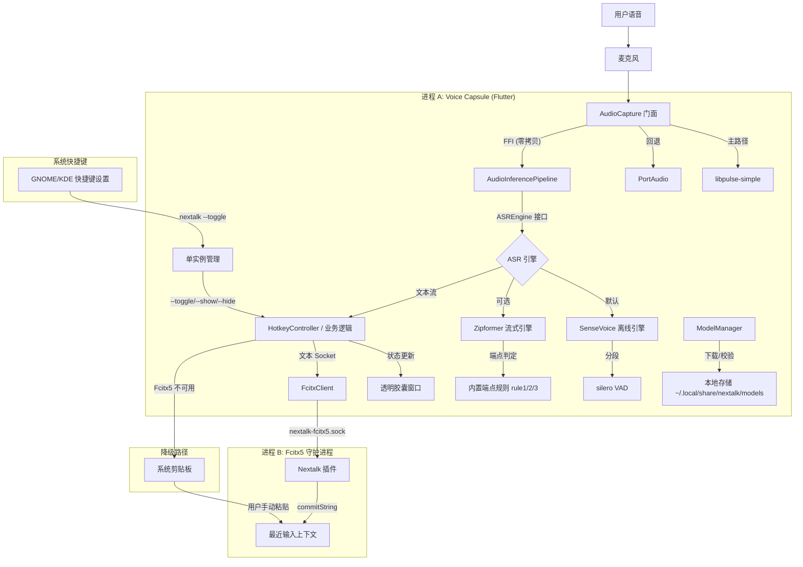

# 架构文档: Nextalk

简体中文 | [English](architecture.md)

| 日期       | 版本 | 说明 | 作者 |
| :---       | :--- | :--- | :--- |
| 2025-12-21 | 1.1  | 完整架构设计 (Flutter/C++混合架构，模型动态下载) | 架构师 (Winston) |
| 2025-12-28 | 2.0  | 极简架构重构 (SCP-002: 移除快捷键监听，使用系统原生快捷键) | 架构师 (Winston) |
| 2026-07-09 | 2.1  | 棕地校准至 v0.2.8：补记双引擎 ASR 架构（SenseVoice 默认）、silero VAD、音频采集分层（libpulse-simple 主/PortAudio 回退）、并发模型结论、IPC 实际约束、模型校验现状、构建/版本管理约定 | 架构师 (Winston) |

## 1. 简介 (Introduction)

**Nextalk** 是一款专为 Linux 设计的高性能语音输入应用，采用混合架构 (Hybrid Architecture)。它结合了现代化的 **Flutter** 前端（负责 UI、流程编排和 AI 推理）与原生的 **C++** 引擎（Fcitx5 插件）来提供系统级输入能力。

系统设计为 **Monorepo (单体仓库)**，包含两个通过 IPC 通信的独立进程：
1.  **Voice Capsule (客户端)**: 一个独立的 Flutter 桌面应用，负责 UI 显示、音频采集、模型管理和语音识别（双引擎：SenseVoice 离线 / Zipformer 流式）。
2.  **Nextalk Addon (服务端)**: 一个轻量级的 Fcitx5 插件，负责接收文本并注入到目标应用程序。

## 2. 高层架构 (High Level Architecture)

### 2.1 系统上下文图



> **SCP-002 变更说明**: 快捷键监听已从 Fcitx5 插件中移除，改为系统原生快捷键配置（如 GNOME 设置 → 键盘 → 自定义快捷键）调用 `nextalk --toggle` 命令。应用自身不做任何全局按键监听。

### 2.2 目录结构 (Monorepo)

项目采用严格的 Monorepo 结构，分离前后端代码与外部依赖。

```text
nextalk/
├── docs/                     # 设计文档 (PRD、架构、UX 规范、开发陷阱)
├── scripts/                  # DevOps 脚本 (build-pkg.sh、docker-build.sh、install_addon.sh、release.sh)
├── version.yaml              # 版本权威来源 (app_version / addon_version)
├── libs/                     # 外部预编译动态库 (.so)
│   ├── libsherpa-onnx-c-api.so
│   └── libonnxruntime.so
├── addons/                   # [后端] Fcitx5 C++ 插件
│   └── fcitx5/
│       ├── CMakeLists.txt
│       └── src/              # nextalk.cpp / nextalk.h / nextalk.conf.in
└── voice_capsule/            # [前端] Flutter 客户端
    ├── pubspec.yaml
    ├── linux/                # Linux 构建配置 (CMakeLists.txt、C++ Runner 改造)
    ├── assets/               # 仅图标、字体等轻量资源 (不含模型)
    └── lib/
        ├── main.dart         # 入口：命令行参数处理 + 单实例 + 服务装配
        ├── app/              # 应用外壳
        ├── cli/              # CLI 子命令 (audio 设备管理)
        ├── constants/        # 常量 (settings/tray/hotkey/window/animation/capsule_colors)
        ├── ffi/              # Native 绑定层
        │   ├── sherpa_onnx_bindings.dart    # 流式识别 C-API
        │   ├── sherpa_offline_bindings.dart # 离线识别 C-API (SenseVoice)
        │   ├── sherpa_vad_bindings.dart     # VAD C-API (silero)
        │   ├── sherpa_ffi.dart
        │   ├── libpulse_ffi.dart            # 设备枚举
        │   ├── libpulse_simple_ffi.dart     # 音频采集主路径
        │   └── portaudio_ffi.dart           # 音频采集回退路径
        ├── l10n/             # 国际化 (zh/en ARB)
        ├── services/         # 业务逻辑
        │   ├── asr/          # ASR 引擎抽象层
        │   │   ├── asr_engine.dart          # ASREngine 接口
        │   │   ├── asr_engine_factory.dart  # 按配置构造引擎
        │   │   ├── engine_initializer.dart  # 初始化/模型检查
        │   │   ├── sensevoice_engine.dart   # 离线引擎 (默认)
        │   │   └── zipformer_engine.dart    # 流式引擎
        │   ├── audio_capture.dart           # 采集门面 (Pulse 主/PortAudio 回退)
        │   ├── pulse_audio_capture.dart     # libpulse-simple 采集实现
        │   ├── audio_device_service.dart    # 设备枚举与选择 (Story 3-9)
        │   ├── audio_inference_pipeline.dart# 采集→VAD→推理流水线
        │   ├── sherpa_service.dart
        │   ├── model_manager.dart           # 三类模型下载与管理
        │   ├── settings_service.dart        # 配置管理 (SharedPreferences + YAML)
        │   ├── hotkey_controller.dart       # 业务状态机 (idle/recording/submitting)
        │   ├── hotkey_service.dart          # 快捷键配置加载 (仅提示文案)
        │   ├── single_instance.dart         # 单实例 + 命令转发 socket
        │   ├── fcitx_client.dart            # 文本上屏客户端 + 剪贴板回退
        │   ├── tray_service.dart            # 系统托盘
        │   ├── language_service.dart        # 界面语言切换 (Story 3-8)
        │   ├── window_service.dart          # 窗口显隐/定位
        │   ├── flutter_window_backend.dart
        │   └── animation_ticker_service.dart
        ├── state/            # 胶囊 UI 状态模型
        ├── ui/               # Widget 组件 (含 init_wizard/ 初始化向导)
        └── utils/            # 工具 (clipboard_helper 等)
```

## 3. 技术栈 (Technology Stack)

| 组件 | 技术 | 版本 | 选型理由 |
| :--- | :--- | :--- | :--- |
| **前端 UI** | Flutter (Dart) | 3.x+ | Linux 上最佳的真透明无边框渲染能力。 |
| **ASR 引擎 (默认)** | Sherpa-onnx SenseVoice (离线) | Latest | VAD 分段后整段识别，精度高，多语言，支持 ITN。 |
| **ASR 引擎 (可选)** | Sherpa-onnx Zipformer (流式) | Latest | 边听边识别，低延迟；int8/standard 双版本。 |
| **端点检测 (SenseVoice)** | silero VAD (经 sherpa-onnx VAD API) | Latest | 独立 VAD 模型，负责离线路径分段。 |
| **端点检测 (Zipformer)** | sherpa-onnx 内置端点规则 (rule1/2/3) | Latest | 流式路径不加载 silero VAD。 |
| **音频采集 (主)** | libpulse-simple | Latest | 设备名与系统设置一致、自动重采样、适配 PipeWire/PulseAudio。 |
| **音频采集 (回退)** | PortAudio | v19 | 非 PulseAudio 系统兼容。 |
| **设备枚举** | libpulse | Latest | 设备列表与系统设置一致 (PipeWire/PulseAudio)。 |
| **语言绑定** | `dart:ffi` | Native | 与 C 库零开销互操作。 |
| **IPC** | Unix Domain Socket | Standard | 简单、安全、低延迟的本地通信。 |
| **后端插件** | C++ | C++17 | Fcitx5 原生插件硬性要求。 |

## 4. 核心组件设计 (Core Component Design)

### 4.1 Fcitx5 插件与协议

**角色**: 文本注入服务。接收 Flutter 客户端的文本，经 Fcitx5 的 `commitString` 接口注入目标应用。

> **SCP-002 简化**: 插件职责收敛为仅文本上屏，快捷键监听与配置同步已移除。

#### 4.1.1 Socket 架构

插件使用单一 Unix Domain Socket 通信：

| Socket 路径 | 方向 | 用途 | 协议 |
| :--- | :--- | :--- | :--- |
| `$XDG_RUNTIME_DIR/nextalk-fcitx5.sock` | Flutter → 插件 | 文本上屏 | 长度前缀 + UTF-8 |

* **传输层**: Unix Domain Socket (Stream 模式)。
* **安全**: 插件在 bind 后对 socket 文件强制 `chmod 0600`（仅属主读写）。
* **协议定义**:

| 偏移 | 类型 | 大小 | 说明 |
| :--- | :--- | :--- | :--- |
| 0 | `uint32` | 4 | **长度** (Little Endian)。后续字符串的字节长度。 |
| 4 | `bytes` | N | **载荷**。UTF-8 编码文本。 |

* **实际约束 (v0.2.8 实现)**:
    * 单条消息上限 `MAX_MESSAGE_SIZE = 1MB`，超限即断开连接。
    * `recv` 超时 30 秒，超时后以零字节探活判断连接存活。
    * 监听循环顺序处理客户端（单客户端模型），无并发连接支持。
* **已知限制 (设计负债)**:
    * 协议无版本号/魔数——客户端无法探测插件版本，协议演进需另行兼容设计。插件对每条消息回发 1 字节 ACK，但客户端当前不消费，无端到端确认语义。
    * `XDG_RUNTIME_DIR` 未设置时回退到 `/tmp/nextalk-fcitx5.sock`（见 §6 安全）。

#### 4.1.2 快捷键方案

**SCP-002 变更**: 快捷键监听已从 Fcitx5 插件移除，改为系统原生快捷键方案：

* **配置方式**: GNOME 设置 → 键盘 → 自定义快捷键（或 KDE 等桌面环境的等价设置）
* **命令**: `nextalk --toggle`（另有 `--show`/`--hide`）

**单实例管理**:
* 应用启动时检测已有实例
* 若已运行，经 Unix Socket（`$XDG_RUNTIME_DIR/nextalk.sock`）转发命令
* 单实例 socket 用于应用内部通信，与 Fcitx5 插件 socket 相互独立

#### 4.1.3 剪贴板 Fallback

当 Fcitx5 插件不可用（非 Fcitx5 环境或插件未加载）时，系统自动启用剪贴板降级：

1. 检查 Fcitx5 Socket 是否存在
2. 不存在则将识别文本复制到系统剪贴板
3. UI 显示提示："已复制到剪贴板，请粘贴"
4. 2 秒后自动隐藏窗口

#### 4.1.4 文本上屏流程 (模拟 IME 周期)

为确保终端等应用正确处理输入，`commitText` 模拟完整 IME 周期：

1. **Set Preedit**: 告知应用"正在输入"
2. **Commit Text**: 调用 `commitString()`
3. **Clear Preedit**: 完成输入周期

文本提交到 Fcitx5 的**最近输入上下文**（`mostRecentInputContext`）——即提交时刻焦点所在的输入框；若无最近上下文，则遍历所有输入上下文寻找任一有焦点者。不存在"锁定录音开始时窗口"的机制。

### 4.2 音频与 AI 流水线

#### 4.2.1 音频采集分层

系统采用**分层音频采集策略**，`AudioCapture` 作为统一门面：

```
┌──────────────────────────────┐
│  AudioCapture (门面)          │ ← 统一 read() 接口，设备回退状态跟踪
└──────────────────────────────┘
     │ 主路径                        │ 回退路径
     ↓                              ↓
┌─────────────────────┐   ┌─────────────────────┐
│  PulseAudioCapture  │   │     PortAudio       │
│  (libpulse-simple)  │   │   (Pa_ReadStream)   │
│  pa_simple_read     │   │   直接 ALSA 访问     │
└─────────────────────┘   └─────────────────────┘
```

**libpulse-simple 主路径优势**:
- 设备名与系统设置完全一致（如 "Built-in Audio Analog Stereo"）
- 自动采样率转换（硬件 44100Hz → 应用 16000Hz）
- 与 PipeWire/PulseAudio 完美集成，优雅处理 WirePlumber 节点挂起

**设备枚举**: 使用 libpulse API（`pa_context_get_source_info_list`）列出设备，并以 sink 预查询唤醒挂起的 PipeWire 节点。设备匹配顺序：精确匹配 → 子串匹配 → 智能默认回退。

#### 4.2.2 双引擎推理路径 (v2.1 补记，Story 2-7)

`ASREngine` 接口统一两条推理路径，由 `ASREngineFactory` 按配置构造，支持托盘热切换：

```
                       AudioInferencePipeline
                     ┌────────────┴────────────┐
              (默认) │                         │ (可选)
                     ↓                         ↓
        ┌─────────────────────┐   ┌─────────────────────┐
        │  SenseVoiceEngine   │   │  ZipformerEngine    │
        │  (离线引擎)          │   │  (流式引擎)          │
        │  silero VAD 分段     │   │  边听边识别          │
        │  → 整段识别          │   │  逐字输出            │
        │  高精度/ITN/多语言   │   │  低延迟             │
        └─────────────────────┘   └─────────────────────┘
```

* **SenseVoice 路径（默认）**: 音频经 silero VAD 累积为语音段，静音触发后将整段送入离线识别器，结果一次性输出。精度高、自动标点，但文本按段出现。
* **Zipformer 路径（可选）**: 音频块直接送入流式识别器，边听边出字；端点判定使用 sherpa-onnx **内置端点规则**（rule1/2/3），不加载 silero VAD 模型。
* 两条路径对上层暴露统一的端点事件流（`EndpointEvent`），但端点检测机制各自独立。

#### 4.2.3 数据流与并发模型

流式路径保持零拷贝设计：

1. **内存分配**: Dart 用 `calloc` 分配堆外缓冲区（`Pointer<Float>`）。
2. **采集**: 该指针传给 `pa_simple_read`（或回退的 `Pa_ReadStream`），音频数据直接写入该内存。
3. **推理**: **同一指针**传给 Sherpa 的 `AcceptWaveform`，Dart/C 边界无数据拷贝。
4. **结果**: 仅识别文本字符串拷贝回 Dart 托管内存用于 UI 显示。

离线路径（SenseVoice）在 VAD 分段时存在必要的语音段缓冲，不属于零拷贝范畴。

**并发模型（v2.1 结论回填）**: 流水线在**主 Isolate** 以异步轮询循环运行（`Future.delayed` 间隔轮询 + 阻塞式 `read`），未使用后台 Isolate。实践验证单块处理耗时远小于块间隔，UI 动画未出现可感知掉帧，原"掉帧则迁移到 `Isolate.spawn`"的预案未触发，现状为最终决定。

### 4.3 FFI 接口定义

Dart FFI 绑定按 sherpa-onnx C-API 的三组接口拆分：

| 绑定文件 | 覆盖 C-API | 用途 |
| :--- | :--- | :--- |
| `sherpa_onnx_bindings.dart` | OnlineRecognizer/OnlineStream | Zipformer 流式识别 |
| `sherpa_offline_bindings.dart` | OfflineRecognizer/OfflineStream | SenseVoice 离线识别 |
| `sherpa_vad_bindings.dart` | VoiceActivityDetector | silero VAD |
| `libpulse_simple_ffi.dart` | pa_simple_* | 音频采集主路径 |
| `libpulse_ffi.dart` | pa_context_* | 设备枚举 |
| `portaudio_ffi.dart` | Pa_* | 音频采集回退路径 |

```dart
// 绑定结构概念示例
typedef AcceptWaveformC = Void Function(Pointer<Void> stream, Int32 sampleRate, Pointer<Float> buffer, Int32 n);
typedef AcceptWaveformDart = void Function(Pointer<Void> stream, int sampleRate, Pointer<Float> buffer, int n);
```

### 4.4 模型管理

为减小安装包体积，模型文件采用**"按需下载"**策略。

1. **存储路径**: 遵循 XDG Base Directory 规范。
   * 路径: `$XDG_DATA_HOME/nextalk/models`（默认 `~/.local/share/nextalk/models`）
2. **管理的模型（v2.1 更新）**:

| 模型 | 用途 | SHA256 校验 |
| :--- | :--- | :--- |
| Zipformer（int8 与 standard 权重同在一个压缩包） | 流式识别 | ✅ 压缩包有官方校验值，下载即校验 |
| SenseVoice | 离线识别 | ⚠️ 官方未发布校验值，跳过 |
| silero_vad.onnx | 端点检测（单文件，仅 SenseVoice 引擎使用） | ⚠️ 官方未发布校验值，跳过 |

3. **启动流程**: 应用启动 → 检查所需模型完整性 → 缺失则进入初始化向导下载，齐备则初始化引擎进入主界面。下载支持进度显示与取消。
4. **模型来源**: GitHub Releases（`k2-fsa/sherpa-onnx`）。
5. **自定义 URL**: 支持经配置文件按引擎（zipformer/sensevoice）分别自定义下载地址（2026-07-09 修复：此前 SenseVoice 字段不生效）。
6. **已知限制**: 无官方校验值的模型仅做存在性/结构检查，供应链完整性依赖下载源可信（见 §6）。

### 4.5 设置服务

设置服务提供引擎/模型选择与高级配置管理。

**架构设计**:
* **双层存储**: 运行时配置用 `SharedPreferences`，高级配置用 YAML 文件。
* **热切换**: 支持运行时切换引擎与模型版本，无需重启应用。
* **XDG 规范**: 配置文件路径遵循 XDG Base Directory 规范。

**配置文件结构（v2.1 与实现同步）**:

```yaml
# ~/.config/nextalk/settings.yaml
model:
  # ASR 引擎类型: zipformer | sensevoice
  engine: sensevoice

  # Zipformer 配置 (流式引擎)
  zipformer:
    # 模型版本: int8 | standard
    type: int8
    # 自定义模型下载地址 (留空使用默认地址)
    custom_url: ""

  # SenseVoice 配置 (离线引擎)
  sensevoice:
    # 逆文本正则化 (如 "一百二十三" → "123")
    use_itn: true
    # 识别语言: auto | zh | en | ja | ko | yue
    language: auto
    custom_url: ""

# 快捷键：经系统设置配置 (命令: nextalk --toggle)，本文件不含快捷键字段

audio:
  # 输入设备: "default" 或系统设置中显示的设备名
  input_device: default
```

**系统托盘集成**:
* 引擎与模型版本切换（勾选项）
* 音频输入设备选择（Story 3-9）
* 界面语言切换 zh/en（Story 3-8）
* "打开配置目录"快捷入口

## 5. 基础设施与构建系统

### 5.1 版本管理（v2.1 新增）

* **权威来源**: 根目录 `version.yaml`（`app_version` 当前 0.2.8，`addon_version` 当前 0.3.0，应用与插件版本独立管理）。
* `scripts/docker-build.sh` 读取 `version.yaml`，经 `--dart-define=APP_VERSION` 注入应用；`pubspec.yaml` 的 version 字段不作为发布版本依据。
* **已知缺口**: `scripts/build-pkg.sh` 直接重建时未传 `--dart-define`，产出二进制自报版本为 "dev"——发布构建应走 docker-build.sh 路径，或修复 build-pkg.sh。

### 5.2 库链接策略

Flutter 的 Linux 构建使用 CMake，需确保外部 `.so` 库被正确打包。

**链接配置 (`linux/CMakeLists.txt`)**:
1. **系统库**: libpulse/libpulse-simple 从系统动态链接（经 dlopen/FFI 加载）。
2. **捆绑库**: `libsherpa-onnx-c-api.so`、`libonnxruntime.so`、`libportaudio.so.2` 复制到构建产物的 `lib/` 目录。

**RPATH 配置**:

```cmake
# linux/CMakeLists.txt
install(FILES "${PROJECT_SOURCE_DIR}/../libs/libsherpa-onnx-c-api.so"
        DESTINATION "${CMAKE_INSTALL_PREFIX}/lib"
        COMPONENT Runtime)

# 二进制在旁路 lib 目录中查找依赖
set(CMAKE_INSTALL_RPATH "$ORIGIN/lib")
```

### 5.3 打包与分发（v2.1 与 Epic 4 对齐）

| 产物 | 脚本 | 说明 |
| :--- | :--- | :--- |
| DEB / RPM 包 | `scripts/build-pkg.sh` | 版本号取自 `version.yaml` |
| Fcitx5 插件 | `scripts/install_addon.sh` | 一键编译安装 |
| 跨发行版构建 | `scripts/docker-build.sh` | Docker 容器内编译，保证 glibc 兼容 |
| 桌面集成 | 打包内含 | .desktop、图标、自启动 |

**Bundle 结构**（保持轻量，不含模型）:

```text
bundle/
├── nextalk              # 可执行文件
├── lib/
│   ├── libsherpa-onnx-c-api.so
│   ├── libonnxruntime.so
│   ├── libportaudio.so.2
│   └── libflutter_linux_gtk.so
└── data/                # Flutter 自身资源 (无模型)
```

## 6. 安全与错误处理

* **Socket 权限**: C++ 插件对 socket 文件强制 `chmod 600`，防止其他用户进程注入恶意文本。
* **/tmp 回退风险（v2.1 记载）**: `XDG_RUNTIME_DIR` 未设置时插件回退到 `/tmp/nextalk-fcitx5.sock`——世界可写目录下的可预测路径，存在被抢占/符号链接攻击的风险（`chmod 600` 无法防止路径抢占）。缓解：正常桌面会话始终设置 `XDG_RUNTIME_DIR`；该回退仅为异常环境兜底。后续可考虑拒绝启动替代回退。
* **消息上限**: 单条消息上限 1MB，防止畸形长度前缀导致的内存放大。
* **网络权限**: Flutter 客户端仅在模型下载时需要网络。
* **下载校验**: 有官方 SHA256 的模型（Zipformer int8）下载后强制校验；无官方校验值的模型跳过校验（已知限制，见 §4.4）。
* **音频故障**: 采集流打开失败（如设备独占/不存在）时，UI 以状态指示可视化告警，并可经初始化向导/托盘重新选择设备。
* **初始化向导（Story 3-7）**: 首次运行引导模型下载、Fcitx5 插件检测与快捷键配置；致命错误弹对话框并给出恢复指引，提交失败保留已识别文本供复制/重试。
