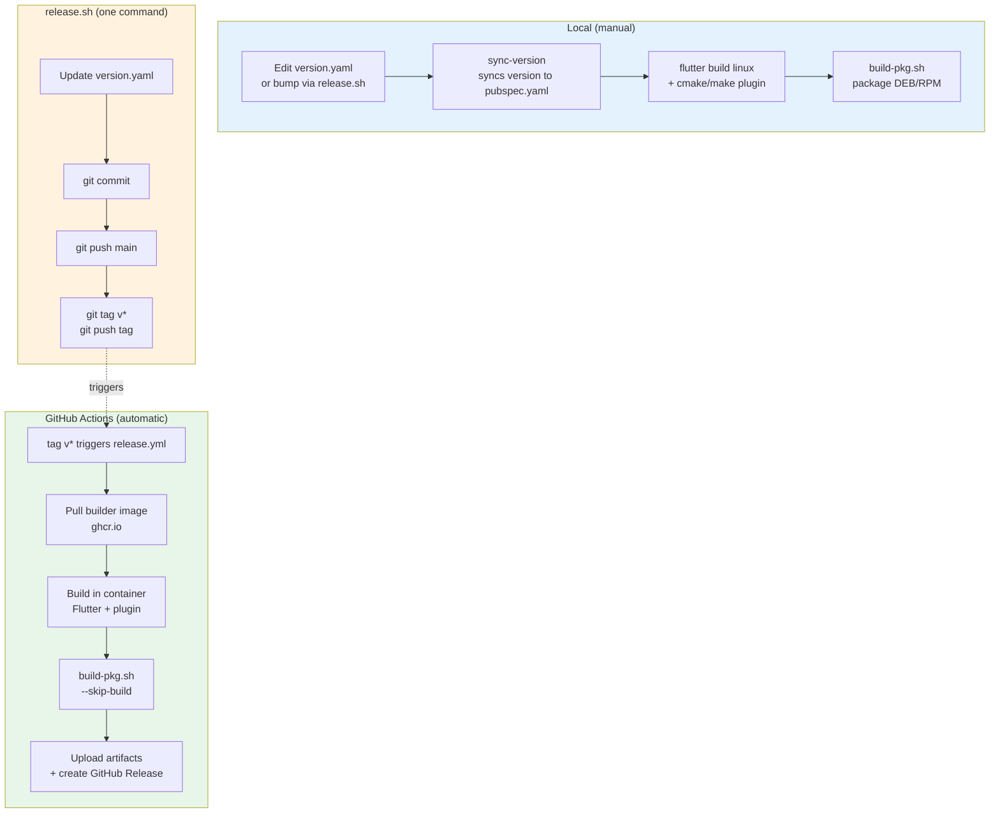
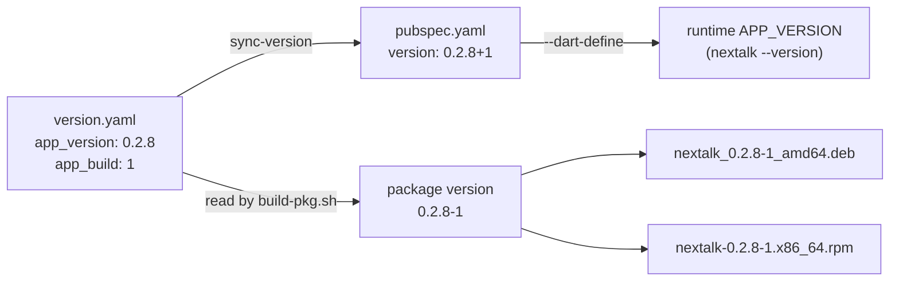
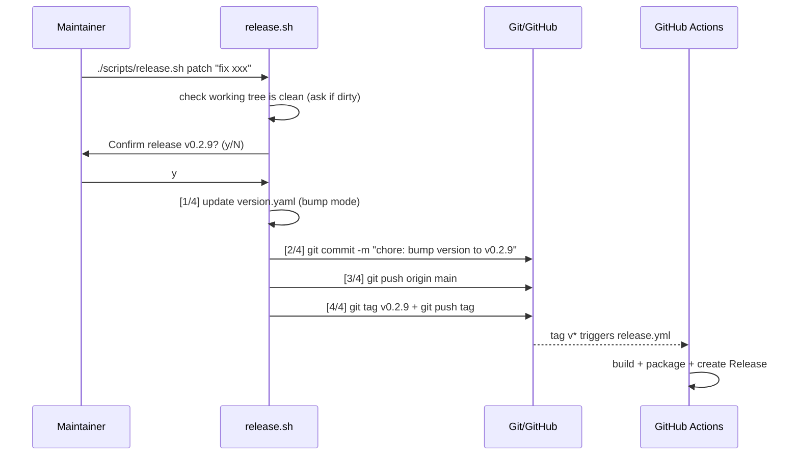
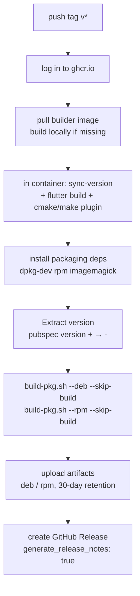

# Build and Release Guide

[简体中文](build-and-release_zh.md) | English

This document targets **maintainers and advanced contributors**. It connects the full Nextalk pipeline from "edit one line of code" to "users can download an installable package": version management → local build → packaging → release → CI/CD.

> Just want to get a local build running? See the [Docker Cross-Distro Build Guide](docker-build-guide.md).
> Just want to install and use? See the [README](../README.md).

---

## Pipeline at a Glance

A formal release takes code through the pipeline below. The left half is what maintainers do locally; the right half is what GitHub Actions does automatically after a tag is pushed.



**Two paths, one set of scripts:**

- **Local manual** (`build → build-pkg.sh`): for development verification and ad-hoc packages.
- **CI automatic** (`release.sh` tags → `release.yml`): the path for formal releases; artifacts are attached to the GitHub Release directly.

Key design: the `build-pkg.sh` that runs in CI is the *same* script used locally, just with `--skip-build` added (reusing artifacts already built in the container). **Packaging logic lives in one place — there is no separate local vs. CI copy.**

---

## 1. Version Management

### Single Source of Truth: `version.yaml`

All version numbers flow from this one file. The app and plugin versions are **managed independently**:

```yaml
# Nextalk version configuration
app_version: "0.2.8"    # Flutter app version (user-visible, determines package name)
app_build: 1            # Build number (combined into 0.2.8-1 at packaging time)
addon_version: "0.3.0"  # Fcitx5 plugin version (evolves independently)
```

Why split app and plugin versions? The plugin (C++ IPC protocol layer) rarely changes once stable, while the app (Flutter UI + ASR) iterates frequently. Splitting them avoids "bumping the plugin version just because a UI label changed."

### How the Version Propagates

`version.yaml` isn't decorative — `sync-version` injects it into the actual build outputs:



- **`sync-version`** (a Makefile target, run automatically before `build-flutter`): writes `app_version+app_build` into the `version:` field of `voice_capsule/pubspec.yaml`. You **almost never edit pubspec.yaml by hand.**
- **`--dart-define=APP_VERSION`**: `build-pkg.sh` injects the version into the Dart runtime at build time; `nextalk --version` reads exactly this.
- **`build-pkg.sh`** independently reads `app_version`/`app_build` from `version.yaml` and forms the package version `0.2.8-1` (DEB) or splits it into `Version=0.2.8 Release=1` (RPM).

> ⚠️ **Mind the version separator**: Flutter/pubspec uses `+` (`0.2.8+1`); Debian/RPM packages use `-` (`0.2.8-1`). The CI `Extract version` step performs the `+ → -` conversion explicitly.

### View and Bump the Version

```bash
make version                 # print current version
./scripts/release.sh patch   # bump patch 0.2.8 → 0.2.9 (see next section)
```

Bumping follows [Semantic Versioning](https://semver.org/): `major.minor.patch`.

---

## 2. Local Build

Three build methods, choose by scenario:

| Method | Command | When to use |
|--------|---------|-------------|
| Local direct build | `make build` | Daily dev, your machine is the target system |
| Docker build | `make docker-build` | **Before release**, for cross-distro compatibility (see [Docker Guide](docker-build-guide.md)) |
| Packaging build | `make package` | Build + package in one step |

### Local Direct Build

```bash
make build            # build everything (Flutter client + Fcitx5 plugin)
make build-flutter    # Flutter client only (auto-runs sync-version first)
make build-addon      # Fcitx5 plugin only
```

Artifact paths:

| Component | Path |
|-----------|------|
| Flutter app | `voice_capsule/build/linux/x64/release/bundle/` |
| Fcitx5 plugin | `addons/fcitx5/build/libnextalk.so` |

### Why Releases Use the Docker Build

Binaries compiled on newer systems (Ubuntu 24.04, Fedora 40+) depend on newer GLib symbols (e.g. `g_once_init_enter_pointer`) and fail to run on older systems. The Docker build is based on Ubuntu 22.04, so its output is backward-compatible. **Always use the Docker build for formal releases** — that's what CI does. See the [Docker Cross-Distro Build Guide](docker-build-guide.md).

---

## 3. Packaging (DEB / RPM)

`scripts/build-pkg.sh` turns build artifacts into system installation packages.

### Usage

```bash
./scripts/build-pkg.sh --deb           # DEB only (Debian/Ubuntu)
./scripts/build-pkg.sh --rpm           # RPM only (Fedora/CentOS/RHEL)
./scripts/build-pkg.sh --all           # both
./scripts/build-pkg.sh --all --rebuild # force rebuild, then package
```

| Option | Description |
|--------|-------------|
| `--deb` / `--rpm` / `--all` | target package format |
| `--clean` | clean the staging directory and exit |
| `--rebuild` | ignore existing artifacts and force a rebuild |
| `--skip-build` | **skip building**, package existing artifacts directly (used by CI and the "Docker build + local package" combo) |

Artifacts land in `dist/`:

```
dist/nextalk_0.2.8-1_amd64.deb
dist/nextalk-0.2.8-1.x86_64.rpm
```

### Packaging Templates

Package metadata comes from templates under `packaging/`. `build-pkg.sh` uses `sed` to replace placeholders like `{{VERSION}}` and `{{INSTALLED_SIZE}}` with real values:

```
packaging/
├── deb/
│   ├── control.template   # dependencies, maintainer, description
│   ├── postinst           # post-install script (restarts Fcitx5 to load the plugin)
│   ├── prerm              # pre-removal script
│   └── nextalk.desktop    # desktop entry
└── rpm/
    └── nextalk.spec.template
```

Edit these templates — not the script — when changing dependencies, the description, or install hooks.

### Recommended Release Build Workflow

To produce a distributable, cross-distro-compatible package locally:

```bash
# 1. Docker build (guarantees compatibility)
./scripts/docker-build.sh --clean

# 2. Package by reusing artifacts (skip the redundant build)
./scripts/build-pkg.sh --all --skip-build
```

Or do it in one step with Docker:

```bash
make docker-package-all   # build in container + package DEB/RPM
```

---

## 4. Release (release.sh)

`scripts/release.sh` is the **single entry point for triggering a formal release**. It doesn't build anything itself — it "updates the version → commits → tags → pushes", using the tag push as the signal handed off to CI.

### Usage

```bash
./scripts/release.sh [current|patch|minor|major] ["commit message"]
```

| Argument | Behavior |
|----------|----------|
| `current` | release with the current version in `version.yaml`, **no bump** (for re-releases / re-tagging) |
| `patch` | `0.2.8 → 0.2.9` |
| `minor` | `0.2.8 → 0.3.0` |
| `major` | `0.2.8 → 1.0.0` |

Makefile shortcuts:

```bash
make release MSG="release notes"        # = release.sh current
make release-patch MSG="fix cold start" # = release.sh patch
make release-minor MSG="add engine switch"
make release-major MSG="architecture rewrite"
```

### Internal Flow



**Four steps**:
1. **Update the version** (only for `patch/minor/major`; `current` skips this)
2. **Commit changes** — commit message is `chore: bump version to vX.Y.Z`, with your note appended
3. **Push main**
4. **Tag and push** — this step is the signal that triggers CI

> ⚠️ The script checks whether the working tree is clean before releasing. It prompts for confirmation on uncommitted changes — don't blindly hit enter on a dirty tree.

### A Typical Release

```bash
# ensure you're on main, tree is clean, changes are merged
git checkout main && git pull

# bump patch and release, triggering CI to produce packages
./scripts/release.sh patch "fix model download timeout on weak networks"

# then watch CI in GitHub Actions; artifacts auto-attach to the Release page
```

---

## 5. CI/CD (GitHub Actions)

Two workflows, each with a distinct job:

| Workflow | Trigger | Responsibility |
|----------|---------|----------------|
| `docker.yml` | `docker/**` changes pushed to main | build the builder image and push to `ghcr.io` |
| `release.yml` | push a `v*` tag (or manual) | build, package, and publish a Release using the builder image |

### The builder image (docker.yml)

Release builds depend on a **pre-built build-environment image** `ghcr.io/<owner>/nextalk-builder:u22` (Ubuntu 22.04 + Flutter + Fcitx5 dev libraries). It only rebuilds and pushes when the `docker/` directory changes, so at release time CI just pulls the ready-made image, saving the time of reinstalling the toolchain each run.

```mermaid
flowchart LR
    A[docker/ change push main] --> B[docker.yml triggers]
    B --> C[docker buildx build]
    C --> D["push ghcr.io/.../nextalk-builder:u22"]
    D -.pulled by release.yml.-> E[reused by release build]
```

### The release pipeline (release.yml)

After a `v*` tag is pushed, `release.yml` runs in sequence:



Key points:

- **`--skip-build`**: the container has already built the artifacts, so the packaging step reuses them instead of recompiling.
- **Version injection**: CI runs the `sync-version` logic itself inside the container (syncing `version.yaml` to pubspec), keeping CI and local versions consistent.
- **Pre-release detection**: when a tag contains `-alpha` / `-beta` / `-rc` it's automatically marked as a prerelease. So to ship a preview, just tag `v0.3.0-rc1`.
- **Release notes**: `generate_release_notes: true` auto-generates change notes from the commits/PRs between two tags.
- **Manual dispatch**: `release.yml` supports `workflow_dispatch`, so it can run without a tag (the `create_release` input controls whether a Release is published).

### Permission Requirements

- `release.yml` needs `contents: write` (create Release) + `packages: read` (pull image).
- `docker.yml` needs `packages: write` (push image).
- Both use the built-in `GITHUB_TOKEN`; no extra secret configuration required.

---

## 6. Release Checklist

Before shipping a version, confirm each item:

- [ ] Code merged into `main`; `make test` and `make analyze` pass
- [ ] `README` / `CHANGELOG` (if any) updated for user-facing changes
- [ ] `app_version` bump in `version.yaml` matches semantic versioning
- [ ] Working tree is clean (`git status` shows nothing left over)
- [ ] Run `./scripts/release.sh <patch|minor|major> "notes"`
- [ ] Watch `release.yml` pass in [GitHub Actions](https://github.com/gonewx/nextalk/actions)
- [ ] Check the DEB/RPM artifacts and auto-generated release notes on the Release page
- [ ] Verify installation on a clean target distro: `sudo dpkg -i` / `sudo rpm -i`

---

## Appendix: Command Cheat Sheet

| Goal | Command |
|------|---------|
| Show current version | `make version` |
| Local build everything | `make build` |
| Docker build (cross-distro) | `make docker-build` |
| Local package DEB+RPM | `./scripts/build-pkg.sh --all` |
| Docker build + package | `make docker-package-all` |
| Package by reusing artifacts | `./scripts/build-pkg.sh --all --skip-build` |
| Bump patch and release | `./scripts/release.sh patch "notes"` |
| Re-release with current version | `./scripts/release.sh current "notes"` |

---

**Related documents:**

- [Docker Cross-Distro Build Guide](docker-build-guide.md) — build environment details
- [Architecture](architecture.md) — system design
- [Development Pitfalls](development-pitfalls.md) — lessons learned
