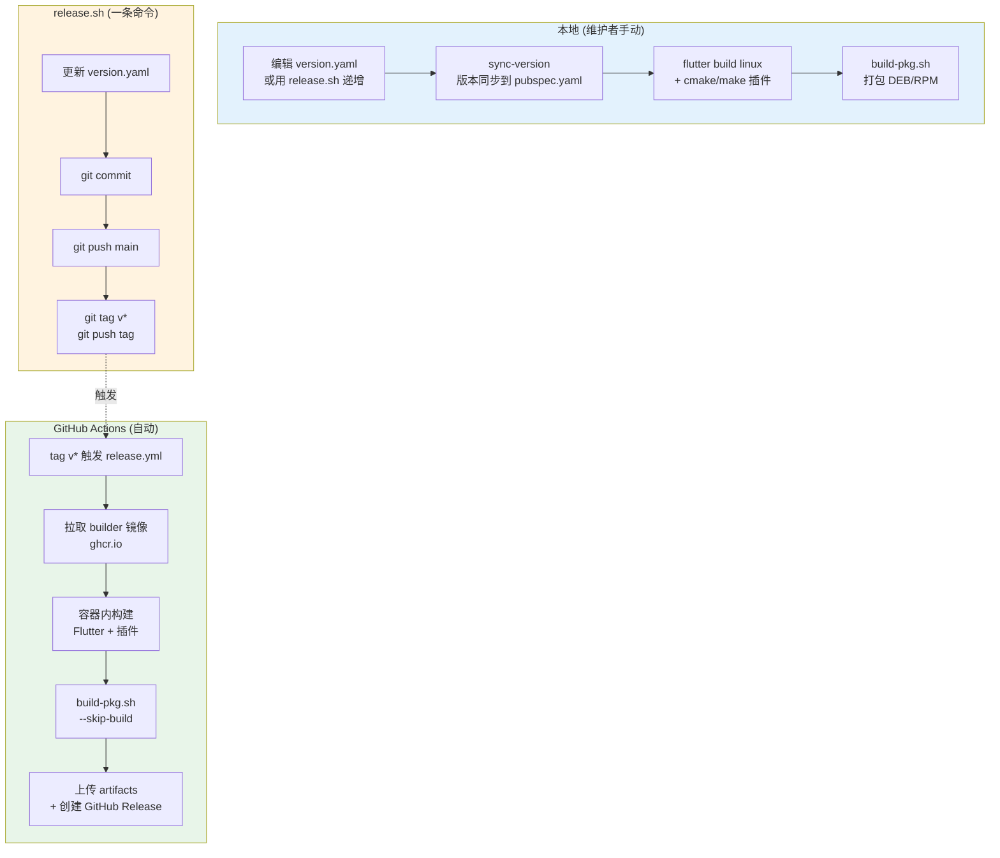
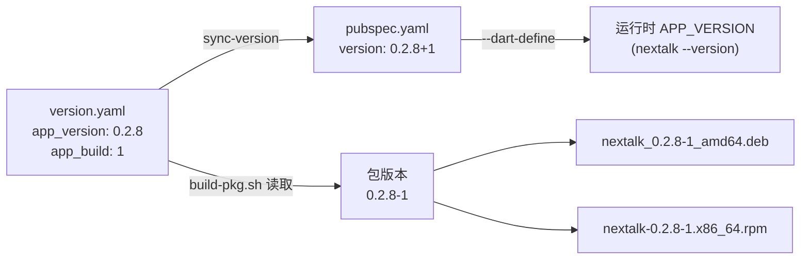
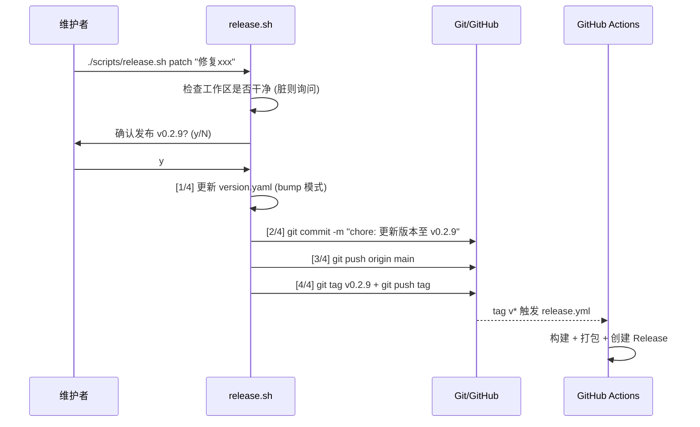
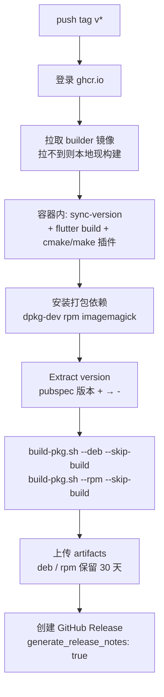

# 构建与发布指南

简体中文 | [English](build-and-release.md)

本文档面向 **维护者与深度贡献者**，完整串联 Nextalk 从「改一行代码」到「用户能下载安装包」的全链路：版本管理 → 本地构建 → 打包 → 发布 → CI/CD。

> 只想快速跑通本地编译？请看 [Docker 跨发行版编译指南](docker-build-guide_zh.md)。
> 只想安装使用？请看 [README](../README_zh.md)。

---

## 全链路一图流

一次正式发布，代码要经过下面这条流水线。左半是维护者在本地做的事，右半是打 tag 后 GitHub Actions 自动完成的事。



**两条路径，同一套脚本：**

- **本地手动**（`build → build-pkg.sh`）：用于开发验证、临时出包。
- **CI 自动**（`release.sh` 打 tag → `release.yml`）：正式发布走这条，产物直接挂到 GitHub Release。

关键设计：CI 里跑的 `build-pkg.sh` 和本地是同一个脚本，只是加了 `--skip-build`（复用容器已构建的产物）。**打包逻辑只有一份，不会本地和 CI 各写一套。**

---

## 一、版本管理

### 单一事实来源：`version.yaml`

所有版本号从 `version.yaml` 这一个文件流出，应用与插件版本**独立管理**：

```yaml
# Nextalk 版本配置
app_version: "0.2.8"    # Flutter 应用版本 (对用户可见，决定包名)
app_build: 1            # 构建号 (打包时拼成 0.2.8-1)
addon_version: "0.3.0"  # Fcitx5 插件版本 (独立演进)
```

为什么应用和插件版本分开？插件（C++ IPC 协议层）稳定后很少动，而应用（Flutter UI + ASR）迭代频繁。分开管理避免「UI 改个文案就被迫给插件也升个版本」。

### 版本如何流向各处

`version.yaml` 不是摆设，它通过 `sync-version` 注入到实际构建物：



- **`sync-version`**（Makefile 目标，被 `build-flutter` 自动前置调用）：把 `app_version+app_build` 写进 `voice_capsule/pubspec.yaml` 的 `version:` 字段。你**几乎不需要手动改 pubspec.yaml**。
- **`--dart-define=APP_VERSION`**：`build-pkg.sh` 构建时把版本号注入 Dart 运行时，`nextalk --version` 读的就是它。
- **`build-pkg.sh`** 独立地从 `version.yaml` 读 `app_version`/`app_build`，拼成包版本 `0.2.8-1`（DEB）或拆成 `Version=0.2.8 Release=1`（RPM）。

> ⚠️ **注意版本分隔符**：Flutter/pubspec 用 `+`（`0.2.8+1`），Debian/RPM 包用 `-`（`0.2.8-1`）。CI 的 `Extract version` 步骤专门做了 `+ → -` 的转换。

### 查看与递增版本

```bash
make version                 # 打印当前版本
./scripts/release.sh patch   # 递增补丁号 0.2.8 → 0.2.9 (下一节详述)
```

递增规则遵循 [语义化版本](https://semver.org/lang/zh-CN/)：`major.minor.patch`。

---

## 二、本地构建

三种构建方式，按场景选择：

| 方式 | 命令 | 何时用 |
|------|------|--------|
| 本地直接构建 | `make build` | 日常开发，你的机器就是目标系统 |
| Docker 构建 | `make docker-build` | **发布前**，保证跨发行版兼容（详见 [Docker 指南](docker-build-guide_zh.md)） |
| 打包构建 | `make package` | 构建 + 打包一步到位 |

### 本地直接构建

```bash
make build            # 构建全部 (Flutter 客户端 + Fcitx5 插件)
make build-flutter    # 仅 Flutter 客户端 (自动前置 sync-version)
make build-addon      # 仅 Fcitx5 插件
```

产物路径：

| 组件 | 路径 |
|------|------|
| Flutter 应用 | `voice_capsule/build/linux/x64/release/bundle/` |
| Fcitx5 插件 | `addons/fcitx5/build/libnextalk.so` |

### 为什么发布要用 Docker 构建

在高版本系统（Ubuntu 24.04、Fedora 40+）上编译的二进制会依赖新版 GLib 符号（如 `g_once_init_enter_pointer`），无法在旧系统运行。Docker 构建基于 Ubuntu 22.04，产物向下兼容。**正式发布务必走 Docker 构建**——CI 也是这么做的。详见 [Docker 跨发行版编译指南](docker-build-guide_zh.md)。

---

## 三、打包（DEB / RPM）

`scripts/build-pkg.sh` 负责把构建产物打成系统安装包。

### 用法

```bash
./scripts/build-pkg.sh --deb           # 仅 DEB (Debian/Ubuntu)
./scripts/build-pkg.sh --rpm           # 仅 RPM (Fedora/CentOS/RHEL)
./scripts/build-pkg.sh --all           # 两种都打
./scripts/build-pkg.sh --all --rebuild # 强制重新构建后打包
```

| 选项 | 说明 |
|------|------|
| `--deb` / `--rpm` / `--all` | 目标包格式 |
| `--clean` | 清理暂存目录后退出 |
| `--rebuild` | 忽略已有产物，强制重新构建 |
| `--skip-build` | **跳过构建**，直接用现有产物打包（CI 与「Docker 构建 + 本地打包」组合用） |

产物输出到 `dist/`：

```
dist/nextalk_0.2.8-1_amd64.deb
dist/nextalk-0.2.8-1.x86_64.rpm
```

### 打包模板

包的元数据来自 `packaging/` 下的模板，`build-pkg.sh` 用 `sed` 把 `{{VERSION}}`、`{{INSTALLED_SIZE}}` 等占位符替换成实际值：

```
packaging/
├── deb/
│   ├── control.template   # 依赖声明、维护者、描述
│   ├── postinst           # 安装后脚本 (重启 Fcitx5 加载插件)
│   ├── prerm              # 卸载前脚本
│   └── nextalk.desktop    # 桌面入口
└── rpm/
    └── nextalk.spec.template
```

修改依赖、描述、安装钩子时改这些模板，而不是改脚本。

### 推荐的发布构建工作流

本地手动出一个可分发的包（跨发行版兼容）：

```bash
# 1. Docker 构建（保证兼容性）
./scripts/docker-build.sh --clean

# 2. 复用产物打包（跳过重复构建）
./scripts/build-pkg.sh --all --skip-build
```

或者用 Docker 一步到位：

```bash
make docker-package-all   # 容器内构建 + 打包 DEB/RPM
```

---

## 四、发布（release.sh）

`scripts/release.sh` 是**触发正式发布的唯一入口**。它不亲自构建，而是「更新版本 → 提交 → 打 tag → 推送」，把打 tag 这一动作作为信号交给 CI。

### 用法

```bash
./scripts/release.sh [current|patch|minor|major] ["提交信息"]
```

| 参数 | 行为 |
|------|------|
| `current` | 用 `version.yaml` 当前版本发布，**不递增**（补发、重打 tag 用） |
| `patch` | `0.2.8 → 0.2.9` |
| `minor` | `0.2.8 → 0.3.0` |
| `major` | `0.2.8 → 1.0.0` |

对应的 Makefile 快捷方式：

```bash
make release MSG="发布说明"          # = release.sh current
make release-patch MSG="修复冷启动"  # = release.sh patch
make release-minor MSG="新增引擎切换"
make release-major MSG="架构重构"
```

### 内部流程



**四步执行**：
1. **更新版本号**（仅 `patch/minor/major`；`current` 跳过）
2. **提交更改** — commit message 为 `chore: 更新版本至 vX.Y.Z`，附上你传入的说明
3. **推送 main**
4. **打 tag 并推送** — 这一步是触发 CI 的信号

> ⚠️ 发布前脚本会检查工作区是否干净。有未提交更改会提示你确认，别在脏工作区盲目回车。

### 一次典型发布

```bash
# 确保在 main 分支、工作区干净、改动已合入
git checkout main && git pull

# 递增补丁版本并发布，触发 CI 出包
./scripts/release.sh patch "修复模型下载在弱网下超时的问题"

# 之后到 GitHub Actions 观察 CI，产物会自动挂到 Release 页
```

---

## 五、CI/CD（GitHub Actions）

两个 workflow 各司其职：

| Workflow | 触发条件 | 职责 |
|----------|---------|------|
| `docker.yml` | `docker/**` 变更推到 main | 构建 builder 镜像并推到 `ghcr.io` |
| `release.yml` | 推送 `v*` tag（或手动） | 用 builder 镜像构建、打包、发 Release |

### builder 镜像（docker.yml）

发布构建依赖一个**预构建的编译环境镜像** `ghcr.io/<owner>/nextalk-builder:u22`（Ubuntu 22.04 + Flutter + Fcitx5 开发库）。它只在 `docker/` 目录变化时才重建并推送，因此正式发布时 CI 直接拉现成镜像，省去每次重装工具链的时间。

```mermaid
flowchart LR
    A[docker/ 变更 push main] --> B[docker.yml 触发]
    B --> C[docker buildx 构建]
    C --> D["推送 ghcr.io/.../nextalk-builder:u22"]
    D -.被 release.yml 拉取.-> E[发布构建复用]
```

### 发布流水线（release.yml）

打 `v*` tag 后，`release.yml` 依次执行：



几个关键点：

- **`--skip-build`**：容器已经构建过产物，打包步骤直接复用，不重复编译。
- **版本注入**：CI 在容器内自己跑了一遍 `sync-version` 逻辑（从 `version.yaml` 同步到 pubspec），保证 CI 与本地版本一致。
- **预发布判定**：tag 含 `-alpha` / `-beta` / `-rc` 时自动标记为 prerelease。所以想发预览版，打 `v0.3.0-rc1` 这样的 tag 即可。
- **Release Notes**：`generate_release_notes: true` 会根据两个 tag 间的 commit/PR 自动生成变更说明。
- **手动触发**：`release.yml` 支持 `workflow_dispatch`，可在不打 tag 的情况下手动跑（`create_release` 输入控制是否发 Release）。

### 权限要求

- `release.yml` 需要 `contents: write`（创建 Release）+ `packages: read`（拉镜像）。
- `docker.yml` 需要 `packages: write`（推镜像）。
- 均使用内置 `GITHUB_TOKEN`，无需额外配置 secret。

---

## 六、发布 Checklist

正式发一个版本前，逐项确认：

- [ ] 代码已合入 `main`，`make test` 与 `make analyze` 通过
- [ ] 若有面向用户的变化，`README` / `CHANGELOG`（如有）已更新
- [ ] 确认 `version.yaml` 里 `app_version` 递增方式符合语义化版本
- [ ] 工作区干净（`git status` 无残留）
- [ ] 运行 `./scripts/release.sh <patch|minor|major> "说明"`
- [ ] 在 [GitHub Actions](https://github.com/gonewx/nextalk/actions) 观察 `release.yml` 跑通
- [ ] 检查 Release 页的 DEB/RPM 产物与自动生成的 Release Notes
- [ ] 在干净的目标发行版上验证安装：`sudo dpkg -i` / `sudo rpm -i`

---

## 附录：命令速查

| 目的 | 命令 |
|------|------|
| 查看当前版本 | `make version` |
| 本地构建全部 | `make build` |
| Docker 构建（跨发行版） | `make docker-build` |
| 本地打包 DEB+RPM | `./scripts/build-pkg.sh --all` |
| Docker 构建 + 打包 | `make docker-package-all` |
| 复用产物打包 | `./scripts/build-pkg.sh --all --skip-build` |
| 递增补丁版本并发布 | `./scripts/release.sh patch "说明"` |
| 用当前版本重新发布 | `./scripts/release.sh current "说明"` |

---

**相关文档：**

- [Docker 跨发行版编译指南](docker-build-guide_zh.md) — 编译环境细节
- [架构文档](architecture_zh.md) — 系统设计
- [开发陷阱](development-pitfalls_zh.md) — 踩坑记录
